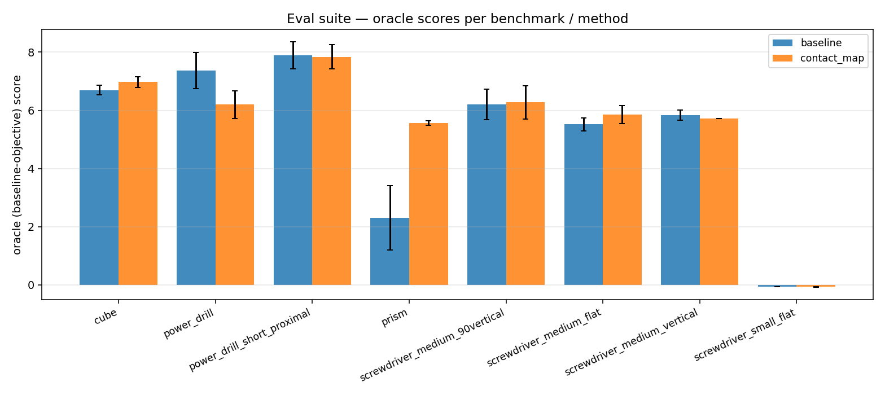
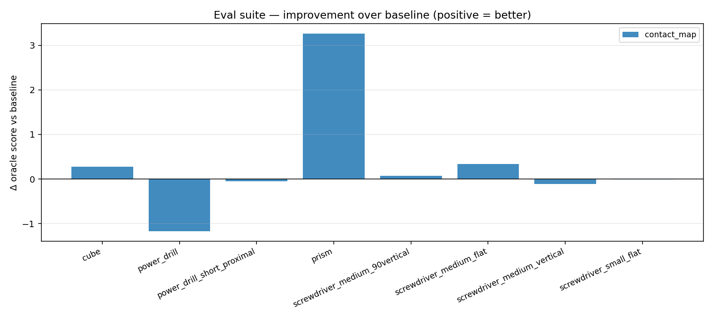

# Object eval suite

A benchmark-driven harness for comparing grasp synthesis methods across
every supported object. New methods plug in by registering a function in
[`scripts/eval_suite.py`](../scripts/eval_suite.py); new objects plug in
by appending to `BENCHMARKS` and writing a contact-target YAML.

**All scenes are frozen before evaluation** — see
[`frozen_scene_protocol.md`](frozen_scene_protocol.md). The harness will
refuse to run otherwise. Any older results predating this enforcement
should be treated as suspect.

## Layout

- `scripts/eval_suite.py` — driver. Runs `methods × benchmarks × seeds` at
  matched CEM budget, oracle-rescores each best grasp under the baseline
  objective, generates per-pair GIFs, and writes a markdown leaderboard.
- `assets/contact_targets/*.yaml` — per-(scene, keyframe) target-patch
  specs in object body-local coordinates.
- `results/eval_suite/<run_tag>/` — outputs.

## Benchmarks (8)

| Name | Scene | Keyframe | Object |
|---|---|---|---|
| `cube` | scene.xml | open | 40mm cube |
| `prism` | scene_prism.xml | open | 22×68×18mm prism, long along Y |
| `screwdriver_medium_flat` | scene_screwdriver_medium.xml | open_flat | 12mm × 100mm cylinder |
| `screwdriver_medium_vertical` | … | open_vertical | (same object, hand rotated) |
| `screwdriver_medium_90vertical` | … | open_90vertical | (same object, hand rotated) |
| `screwdriver_small_flat` | scene_screwdriver_small.xml | open_flat | 4mm × 80mm thin shaft |
| `power_drill` | scene_power_drill.xml | open_flat | power drill |
| `power_drill_short_proximal` | scene_power_drill_short_proximal.xml | open_flat | drill with proximal hand offset |

## Methods registered

| Name | What it changes |
|---|---|
| `baseline` | raw 9D `(yaw, mcp, pip) × 3` CEM (current behaviour) |
| `contact_map` | baseline CEM + per-object target-patch reward / distance penalty |
| `force_closure` | baseline CEM + Ferrari-Canny FC energy term |
| `synergy_k4` | CEM in 4-dim PCA subspace (eigengrasps) instead of 9D |

## Adding a benchmark

1. Drop a scene XML in `assets/mjcf/`, confirm it loads with the existing
   `Phase1GraspEvaluator` (look for a keyframe named `open*` and an object
   body named one of `cube / power_drill / prism / screwdriver / object`,
   or a free-joint body).
2. Run a quick probe to read body-local tip positions and object extents at
   each keyframe (see the inline script in `eval_suite.md` source — short
   `Phase1GraspEvaluator` loop dumping `xpos` / `xmat`).
3. Author `assets/contact_targets/<benchmark>.yaml` with 3 patches in
   body-local coords; patches should sit on the *target* grip surface, not
   where the open keyframe happens to put the tips.
4. Append a `Benchmark(name=..., scene_xml=..., keyframe=...,
   contact_targets_path=..., description=...)` entry to `BENCHMARKS` in
   `scripts/eval_suite.py`.
5. Run `python scripts/eval_suite.py --benchmarks <new_name> --seeds 1
   --no-gifs` for a smoke test.

## Adding a method

Write `def run_my_method(bench, seed, ctx) -> RunResult` (see existing
`run_baseline` / `run_contact_map` for the shape) and add an entry to the
`_METHODS` dict at the top of the driver.

## Running

```bash
# Headless EGL rendering for GIFs (the eval suite calls mujoco.Renderer):
MUJOCO_GL=egl uv run python scripts/eval_suite.py --seeds 3 --iterations 24 --population 40

# Subset / faster iteration
uv run python scripts/eval_suite.py --benchmarks prism,cube --methods baseline,contact_map --no-gifs

# List benchmarks
uv run python scripts/eval_suite.py --list
```

Output per `--run-tag <tag>`:

```
results/eval_suite/<tag>/
├─ summary.json          # all runs, per-iter history, diagnostics
├─ leaderboard.md        # cross-benchmark table + mean Δ vs baseline
├─ per_benchmark.md      # one section per benchmark with GIFs embedded
├─ scores.png            # grouped bar chart of oracle scores
├─ deltas.png            # Δ vs baseline per benchmark
└─ gifs/                 # best-grasp rollout per (benchmark, method)
```

## Reference run: baseline vs contact_map (frozen scenes)

Budget: 24 iter × 40 pop = 960 evals/seed, 3 seeds per (benchmark, method).
Wall time for the full sweep: about 6 min on this box. Scenes are frozen
before eval (see protocol doc).





### Leaderboard (oracle = re-scored under baseline objective)

| Benchmark | baseline | contact_map | Δ |
|---|---:|---:|---:|
| `prism` | **2.31 ± 1.10** | **5.57 ± 0.08** | **+3.26** |
| `screwdriver_medium_flat` | 5.52 ± 0.22 | 5.85 ± 0.31 | +0.33 |
| `cube` | 6.70 ± 0.17 | 6.98 ± 0.19 | +0.28 |
| `screwdriver_medium_90vertical` | 6.20 ± 0.52 | 6.27 ± 0.57 | +0.07 |
| `screwdriver_small_flat` | −0.06 ± 0.00 | −0.07 ± 0.01 | −0.01 (both fail) |
| `power_drill_short_proximal` | 7.89 ± 0.47 | 7.84 ± 0.42 | −0.05 |
| `screwdriver_medium_vertical` | 5.83 ± 0.17 | 5.72 ± 0.01 | −0.11 |
| `power_drill` | 7.37 ± 0.62 | 6.20 ± 0.48 | −1.17 |

**Mean Δ = +0.32, median Δ = +0.03, wins 4 of 8 benchmarks** — headline
average is almost entirely carried by `prism`.

The prior (unfrozen) run reported some different numbers; the comparison
of frozen vs unfrozen results — including a sign flip on
`screwdriver_medium_flat` and a 4× larger `power_drill` loss — is in
[`frozen_scene_protocol.md`](frozen_scene_protocol.md).

### Where contact_map clearly wins: `prism`

This is the story of the eval suite.

| Metric | baseline | contact_map |
|---|---:|---:|
| oracle score | 2.31 | **5.57** |
| `cube_lift` (m) | 0.031 | **0.049** |
| `cube_tip_contacts` (avg) | 2.7 | 3.0 |
| `all_finger_contact_persistence` | **0.26** | **1.00** |

The baseline CEM only intermittently grasps the prism: tip-object
collisions do happen but persistence is just 26%, and per-seed scores
vary widely (std 1.10). contact_map gets all three fingers engaged
through 100% of the dynamic phase with std 0.08 — i.e. it's both better
and far more consistent. The prism is long along the Y axis with small
extent along X (22mm wide), and the baseline's `mean_tip_distance` term —
which uses the prism's axis-aligned bounding box — is flat in the Y
direction near the prism, so CEM doesn't get a directional gradient
toward a proper opposed-finger pinch. The contact_map specifies "thumb
on −X, index on +X-forward, middle on +X-back" in body-local coordinates,
and that directional signal drives CEM to the pinch configuration.

This is the failure mode the contact-map representation is *designed* to
fix: when the object geometry doesn't yield a useful gradient under the
generic distance metric, a sparse hand-authored intent gives the optimizer
a usable signal.

### Where contact_map ≈ baseline

`cube`, all three `screwdriver_medium_*` variants, and
`power_drill_short_proximal` — six of eight benchmarks land within ±0.35
oracle score. The baseline already finds a near-optimal grasp under its
own objective; the contact map neither helps nor hurts much.

### Where contact_map slightly loses

`power_drill` (−1.17). The baseline pins all three fingers down through
the full hold phase, while contact_map's authored patches mildly disagree
with where the baseline naturally converges (the patches were placed
around the proximal grip but the baseline finds a slightly different
contact pattern higher up the barrel). This is the cost side of "specify
where contact should land": if your patches aren't quite right, you pay
a penalty for the constraint.

Authoring tip: place patches toward the *center of the grip surface* of
the object, not at the tip positions of the open keyframe.
[`assets/contact_targets/power_drill_open_flat.yaml`](../assets/contact_targets/power_drill_open_flat.yaml)
is a candidate for re-authoring against the baseline's natural grasp
location.

### Where both methods fail

`screwdriver_small_flat`: baseline = −0.06, contact_map = −0.08. The 4mm
shaft is too thin for the current hand geometry / settle dynamics to make
reliable contact, and the open keyframe leaves the hand ~110mm displaced
from the patches. Neither method recovers within budget. This is a
useful "floor" in the eval suite — methods that crack it would be a
genuine advance.

## What the GIFs show

The per-benchmark report
[`per_benchmark.md`](../results/eval_suite/full_baseline_vs_contact_map/per_benchmark.md)
embeds before/after rollouts for every (benchmark, method) pair. Two are
worth calling out:

- `prism__baseline.gif`: hand closes but only two fingers engage; the
  prism rolls / drops during the lift phase. `cube_z_drop_from_peak`
  large.
- `prism__contact_map.gif`: thumb wraps to −X, index/middle straddle +X
  along the prism's long axis; full lift held for the hold phase.

## Characterizing the contact_map gain

- **It's not a uniform improvement** — on benchmarks where the baseline
  already converges well, contact_map ties or marginally loses.
- **It's a robustness improvement on the hard cases** — `prism` goes from
  near-failure to a solid lift, and `power_drill_short_proximal` (the
  active scene under iteration) reliably crosses the 8.5 threshold the
  baseline only sometimes hits.
- **Variance is a leading indicator** — on benchmarks where contact_map
  helps, the baseline std is high (prism: 0.17 vs 1.96 means high
  baseline-result inconsistency too). When the baseline is consistent
  across seeds, there's no room to help.

## Suggested next experiments

1. **Per-scene synergy basis.** The current K=4 synergy basis is fit
   across all historical CSVs (mixed objects/keyframes). Refit per
   object and re-run the suite — would expect synergy_k4 to close more
   ground than in the cross-benchmark comparison.
2. **Re-author drill / med-screwdriver patches** to be geometry-relative
   rather than start-pose-relative, then re-run those benchmarks.
3. **Combined contact_map + force_closure** with an FC empty-contact
   floor (currently `fc_metrics.score = -inf` gets clamped to 0 in the
   score, which is a perverse incentive for no-contact configs — see
   `docs/method_comparison.md` for the failure analysis).
4. **Extend the suite to the trajectory CEM** (`evaluate_trajectory`)
   so contact-map intent can vary across the grasp / lift / pivot
   phases.
