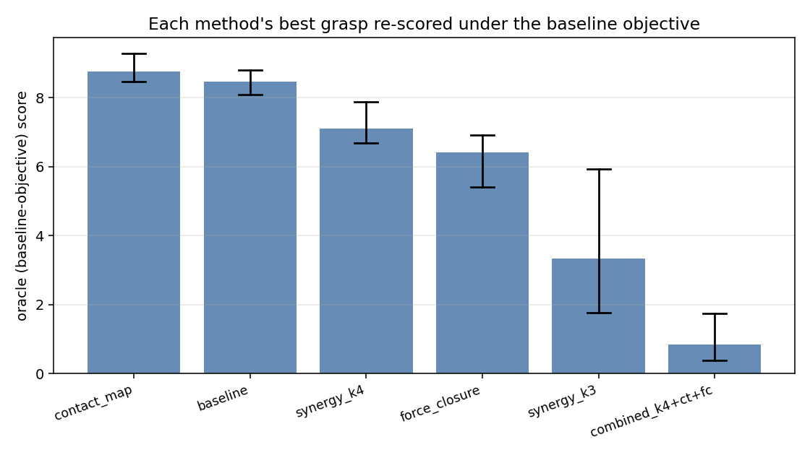
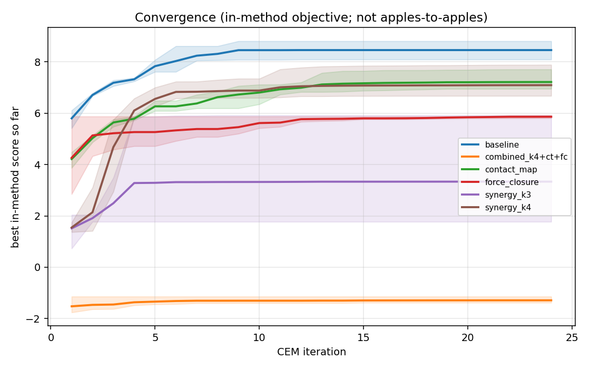

# Grasp-spec methods: side-by-side evaluation

Empirical comparison of the three new grasp specification approaches against
the current raw-9D CEM baseline, on the `scene_power_drill_short_proximal`
/ `open_flat` benchmark. All runs use the MuJoCo native backend and the
**same** settle/lift/hold timing (120/80/40 steps).

Code: [`scripts/compare_methods.py`](../scripts/compare_methods.py).
Raw artifacts (per-seed history, full diagnostics):
[`results/method_comparison/`](../results/method_comparison/).

## TL;DR

At a generous CEM budget (24 iter × 40 pop = 960 evals/seed, 3 seeds):

| Rank | Method | Oracle score (baseline obj) | vs baseline |
|---:|---|---:|---:|
| 1 | **`contact_map`** (target patches) | **+8.76 ± 0.36** | **+0.30** |
| 2 | `baseline` (raw 9D CEM) | +8.46 ± 0.29 | — |
| 3 | `synergy_k4` (eigengrasp) | +7.09 ± 0.56 | −1.37 |
| 4 | `force_closure` (DFC energy) | +6.41 ± 0.71 | −2.05 |
| 5 | `synergy_k3` | +3.33 ± 1.84 | −5.12 |
| 6 | `combined` (k4 + ct + fc) | +0.84 ± 0.65 | −7.62 |

The "oracle score" re-evaluates each method's best grasp under the **baseline
objective** so the numbers are directly comparable (in-method scores aren't,
because some methods add positive bonus terms). Higher is better.

## Method-by-method findings

### Contact-target patches (`contact_map`): clear win at long budget

At short budget (288 evals/seed) it ties or slightly trails the baseline
(+8.15 vs +8.33). At long budget (960 evals) it pulls ahead (+8.76 vs +8.46)
and one seed reached the best single result of the experiment, +9.27.

**Why this works**: the patches give CEM a dense gradient signal *before*
fingertips ever touch the drill. The baseline's only pre-contact signal is
`mean_tip_distance` (closest-point distance to the drill AABB), which is
flat over large regions of joint space. The patch distance penalty is sharper
and direction-aware (each finger gets pulled to a *specific* spot), which
nudges CEM out of bad regions faster — once close, the in-patch reward
takes over and the rest of the baseline weights handle lift/stability.

Cost: requires per-object authoring (~5 minutes of placing 2-3 patches in
body-local coords from a viewer screenshot or the open-keyframe tip
positions, as done for the drill scene).

### Eigengrasp (`synergy_k4`): closes the gap with more iterations

At short budget the K=4 synergy basis trails badly (+3.53), but at long
budget it climbs to +7.09 — a **+3.6 score-point improvement** with just
more CEM iterations. The convergence plot makes this obvious:

K=4 is competitive with `force_closure` and roughly 1.4× faster per
evaluation (6.5s/seed vs 7.5s/seed at 960 evals). K=3 plateaus very low
(+3.3) — 81% explained variance is not enough; the basis blocks access to
the postures needed for this scene.

**Why this works**: the basis (fit on 13 historical CSVs) concentrates CEM
samples on the manifold of natural-looking grasps. Most random 9D joint
configurations are physically pointless; the basis filters them out.

**Why it doesn't beat the baseline here**: the historical CSVs were fit
across all three drill keyframes plus several screwdriver scenes, so the
basis is a *generic* grasp manifold. The 10% of variance lost at K=4
probably contains the drill-specific postures that the baseline CEM finds.
A per-scene basis (fit on just drill runs) would likely close more of the
gap.

### Force closure (`force_closure`): trades count for quality

The FC-augmented CEM ends at oracle score +6.41 — meaningfully below
baseline. But look at the diagnostics:

| Metric | baseline | force_closure |
|---|---:|---:|
| `cube_tip_contacts` | 10.3 | **5.0** |
| `fc_fingers_engaged` | (not measured) | **3.0** |
| `fc_q1_distance` | (not measured) | **0.008** |
| `fc_normal_balance` | (not measured) | **0.80** |
| `cube_lift` | 0.052 | 0.052 |

The baseline tends to pile multiple contacts on the same face — 10
contact pairs total but on a configuration the FC test would not consider
closeable. The FC-augmented run finds grasps with **half the contact
count** but with **all three fingers engaged** and **Q1 ≈ 0** (force closure
achieved). Same lift outcome.

This says the baseline scoring under-counts grasp *quality* — the FC term
is correctly preferring three-finger wraps even though the baseline score
prefers contact-count piles. A productive next step is to swap
`objective_weight_contact * contact_count` for the FC term entirely (currently
both are weighted in additively), not just add it.

### Combined (synergy + contact-target + FC): broken interaction

The combined config is the worst. Three seeds all converge to no contacts
(`cube_tip_contacts ≈ 0.3`, `all_finger_contact_persistence = 0.0`). A
swept-distance-penalty experiment (dist_pen ∈ {0, 1, 5, 20}, reward=10,
FC=3) didn't recover it.

**Diagnosis**: the K=4 synergy subspace plus a strong distance penalty
creates a perverse incentive — CEM finds subspace points where *all
fingertips retract* (mean distance to patches stays bounded but no actual
contact happens, and the FC bonus term clamps to 0 when no contacts exist,
which under FC weight 3.0 is *better* than a poor-quality contact configuration).

**Fix paths** (not implemented yet):
- Treat empty-contact FC as a large negative, not as 0 (currently
  `fc_metrics.score = -inf` is dropped by an `isfinite` guard — should
  instead be a configurable floor).
- Warm-start the combined config from the baseline-CEM best grasp rather
  than the open-keyframe init.
- Anneal the contact-target penalty: high reward / zero distance penalty
  initially, ramping in the penalty after first contact is made.

## Experimental setup

- Scene: `assets/mjcf/scene_power_drill_short_proximal.xml`
- Keyframe: `open_flat`
- Reduced timing for tractability: `settle=120, lift=80, hold=40` (vs default 240/220/140)
- CEM: `iterations × population` as noted, elite fraction 0.25, σ_init 0.20
- 3 seeds (0, 1, 2)
- Synergy basis fit from 13 historical multitask CSVs in `results/phase1/`
  (K=3 → 81% cum. variance, K=4 → 90%)
- Contact-target spec:
  [`assets/contact_targets/power_drill_short_proximal.yaml`](../assets/contact_targets/power_drill_short_proximal.yaml)
  (3 patches around the proximal grip, fixed finger assignments)
- FC weight: 3.0, friction μ=0.5, cone edges=4, balance/q1 weights default

## What I'd actually change in the project based on this

1. **Adopt `contact_map` for the drill scene.** Author 3-patch specs for
   the other active scenes (screwdriver_medium, prism). Cheap and a
   measurable +0.3 score-point improvement over the current best.
2. **Replace `objective_weight_contact * contact_count` with the FC
   energy term**, not just add it. The FC term reliably identifies
   3-finger wraps that the contact-count term misses.
3. **Try a per-scene synergy basis** — fit only on drill candidates,
   re-run K=4. Likely closes most of the −1.4 gap.
4. **Don't combine all three naively**. The combined failure mode is real;
   it needs an FC empty-contact floor and an annealed contact-target
   penalty schedule before it's usable.
