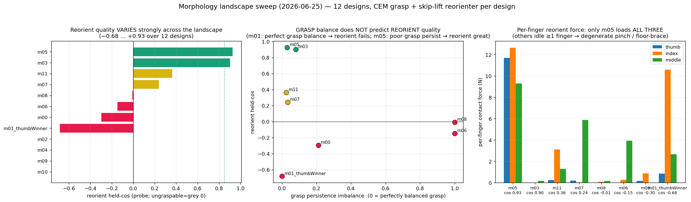
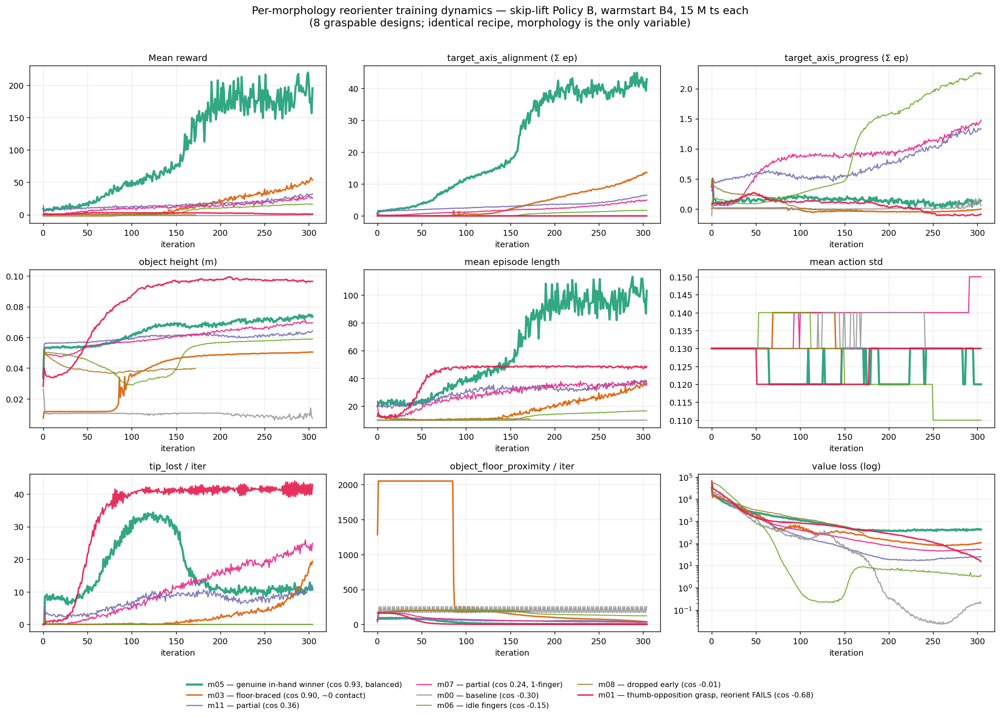
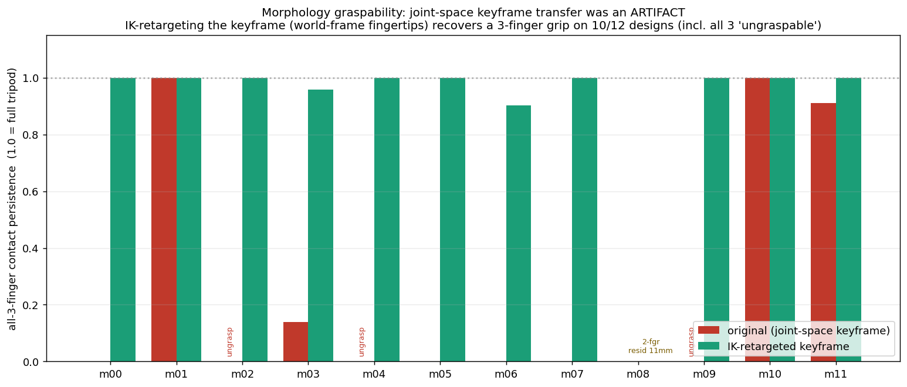
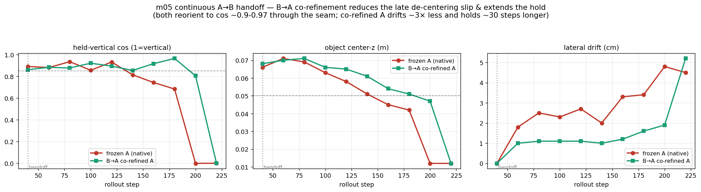
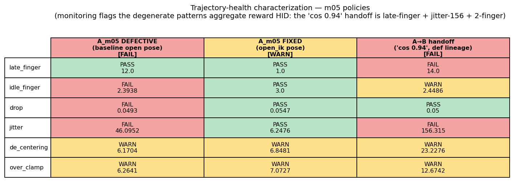
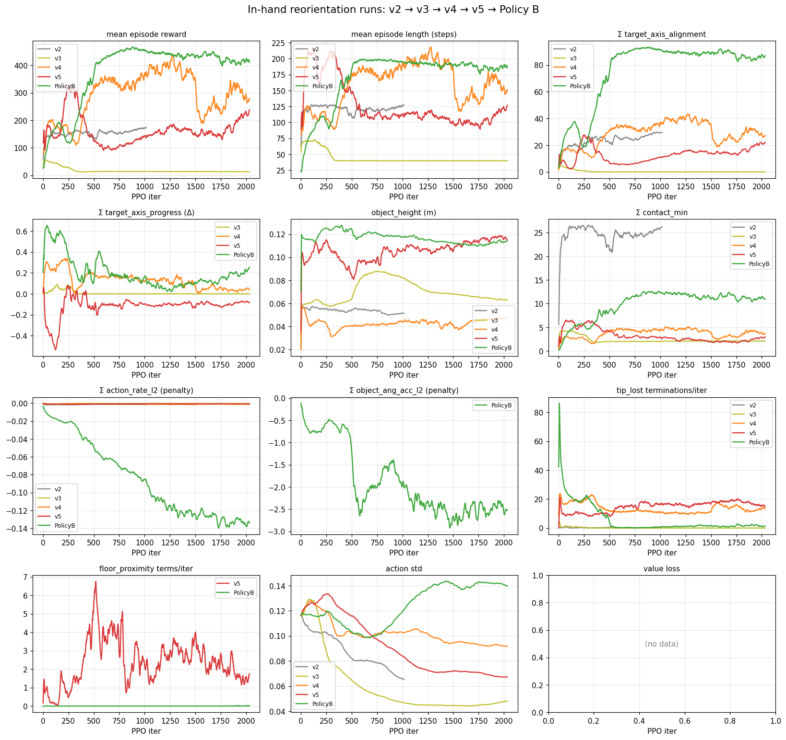
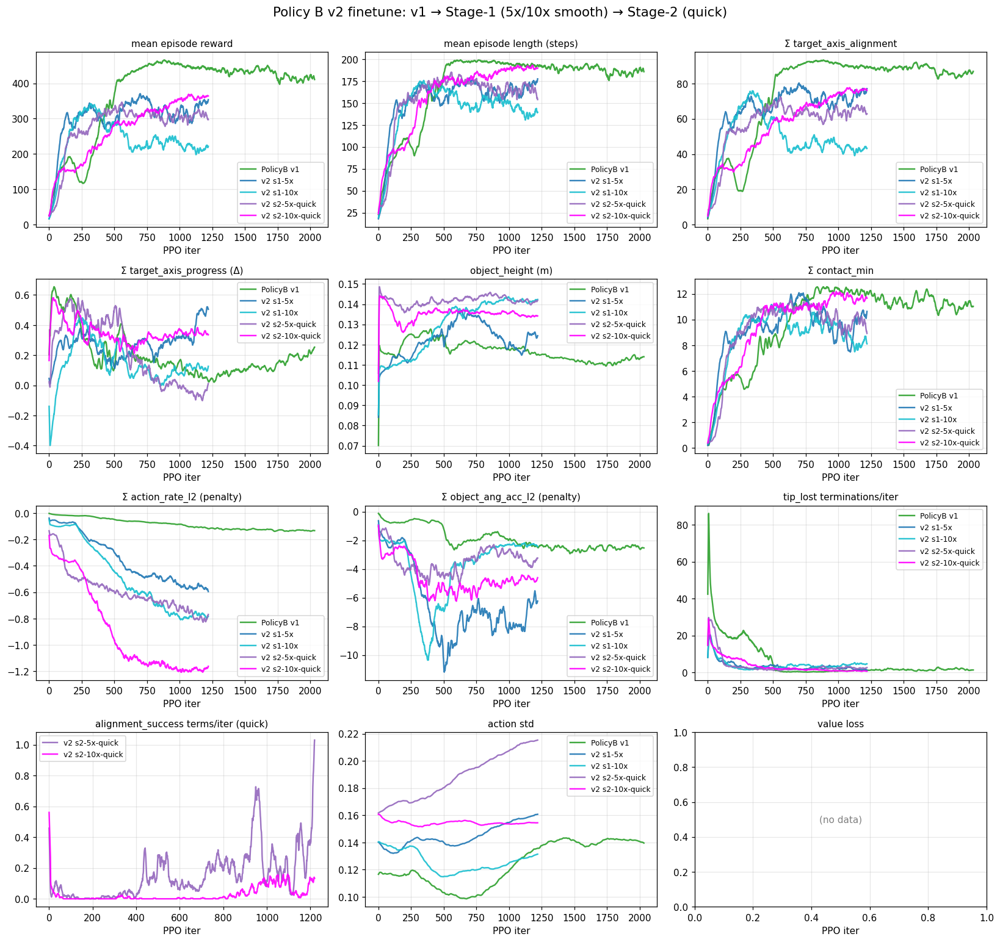

# In-Hand Reorientation

A chronological log of the in-hand reorientation training journey:
flat-laying screwdriver_medium → vertical, finger-only control.

Style follows [phases.md](phases.md) — each section captures **goal**,
what **changed**, **result**, **takeaway**. New attempts append here; do
not edit prior entries except for factual corrections (this is the
historical record).

For the related grasp work see [phases.md](phases.md). For architecture
details on `LerpFinger` / `ScriptedPalm` see
[architecture.md](architecture.md). The earlier design memo lives at
[inhand_reorient.md](inhand_reorient.md) (kept for reference; this doc
supersedes it as the source of truth).

---

## Task definition

**Scene:** `scene_screwdriver_medium_flat_short_proximal.xml`. Cylinder
(R = 12.5 mm, L = 80 mm) lying flat on the floor with body quat ≈
(0.707, 0.707, 0, 0) — a 90° X-rotation that puts the cylinder's long
axis along world Y. Mass 16 g, friction (2.4, 0.2, 0.02).

**Goal:** the cylinder's body-local +Z (long axis) aligned with world +Z
(vertical). Cosine alignment goes from ~0 (flat) to ~1 (vertical) without
dropping the cylinder or letting it touch the floor.

**Constraints (per user):**
1. **Finger-only manipulation.** The palm's 6 joints are scripted; only
   the 9 finger DOFs are policy-controlled.
2. **Maintain contact throughout.** Tip-lost = drop, terminate.
3. **No floor assistance.** The reorientation must be in-hand; floor
   contact during the rotation phase = cheating. (This constraint was
   added after v4 — see Phase v4 below.)
4. **Sim-to-real safety.** Motion should be smooth (no high-frequency
   finger jitter that wouldn't survive motor delays / sensor noise).
   (Added after Policy B v1 — see Phase Policy B below.)

---

## Representation

### Observation (full mode)

Standard manipulation obs plus reorient-specific additions:

- Per-joint robot state (palm + fingers): `joint_pos`, `joint_vel`
- Object pose in palm frame: `object_pose_actual` (3 pos + 4 quat)
- Object linear + angular velocity
- Per-fingertip contact: `fingertip_cube_contact.found` (binary per tip)
- Per-step fingertip-to-object distance
- Last policy action (for residual modeling)
- **`target_axis_misalignment`**: scalar acos(cos(object_axis,
  target_axis_world)) — added for the reorient task so the policy sees
  the misalignment angle directly instead of having to infer it from
  the raw quat.

### Action

9-dim finger residual on top of `LerpFinger` setpoint, scale 0.5 rad.

`LerpFinger` interpolates from `open_finger_qpos` toward
`finger_default_ctrl` (CEM grip) over `finger_close_sim_steps`. Policy
adds ±0.5 rad on top of this time-varying setpoint.

**Palm action is scripted** (`ScriptedPalmAction`): hold at CEM keyframe
during settle (`settle_steps=240` sim steps), then ramp palm_pz by
`lift_delta_z` over `lift_ramp_steps=80` sim steps. Palm rotations
(rx/ry/rz) are held at the keyframe value.

A 12-dim action variant (9 finger + 3 palm rotation residuals) was
prototyped (v1) and rejected — see Phase v1.

### Warmstart

All runs warmstart the actor from
`medium_flat_stable_v1/model_500.pt` (the lift-only policy on the same
scene). When the obs / action dim differs, partial state_dict load:
overlapping shapes copied, new entries **zero-init** (not random — see
"Cross-phase lessons" at the bottom).

---

## Reward shaping

The reward landscape is the central design problem. Below is the final
working set, in order of weight magnitude.

| Term | Final weight | Notes |
|---|---|---|
| `target_axis_alignment` | +100 | `exp(-α·(1-cos)²)` of object-axis-to-target. α annealed 0.5 → 4.0 over 300 iters. |
| `target_axis_progress` | +300 | Δ(alignment cos) per step, clamped non-negative. Dense gradient toward rotating in the right direction. |
| `lift_height` (or skip-lift) | +80 | Clamped (object_z − settle_z) up to `lift_target`. Set to 0 weight in skip-lift mode. |
| `contact_min` | +15 | Min over the 3 fingertip contacts. Reduced from 30 (lift recipe) to allow regrip during rotation. |
| `contact_mean` | +10 | Mean of the 3 fingertip contacts. Encourages overall grip stability. |
| `fingertip_to_object` | −3 | Penalty per metre of distance. Keeps fingers near cylinder. |
| `joint_pos_limits` | −2 | Standard safety. |
| `finger_drift_from_grip` | −0.3 | Reduced from −2 (lift recipe) so fingers can articulate enough to roll the cylinder. |
| `object_xy_drift` | −3 | Standard stability. |
| `object_orientation_drift` | **0** | **Must be 0**: any non-zero penalty actively trains against rotation. Found by v2 diagnosis. |
| `action_rate_l2` | −0.005 → −0.1 | Bumped 20× for Policy B to suppress sim-only finger jitter. |
| `object_ang_acc_l2` | (new) −0.05 | New: L2 of cylinder angular-velocity Δ per step. Penalizes high-frequency vibration of the rotation. |

### Curricula

- **`target_axis_alpha_curriculum_iters=300`** anneals the alignment
  reward's `α` from `target_axis_alpha_start=0.5` (soft, wide basin —
  gradient at large tilts) to `target_axis_alpha=4.0` (sharp, focused
  on near-target). Soft start gives gradient when cos ≈ 0 (flat);
  sharp end focuses on the home stretch.
- **`tracking_anneal_iters=0`** (disabled). Tracking-from-CEM rewards
  are off — they were tuned for the lift-only behavior and conflict
  with rotation.

### Terminations

| Term | Role |
|---|---|
| `tip_lost` (10-step consecutive grace) | Real drop detection. Kept across all runs. |
| `object_drop` (z < spawn_z − 2 cm) | Belt-and-braces drop check. |
| `object_floor_proximity` (z < `object_min_z`) | **New v5+**: forbid floor-bracing — terminate if object center falls below 0.05 m world z during reorient phase. |
| `finger_slip` (drift > 0.3 rad from CEM grip) | **Disabled** for reorient (`100.0` rad). Fingers need to articulate. |
| `object_orientation_slip` (drift > 0.5 rad ≈ 28°) | **Disabled** for reorient (10.0 rad). Goal IS 90° rotation. |
| `object_slip_xy` (xy drift > 1.5 cm) | **Disabled** for reorient (0.5 m). Cylinder translates during regrip. |

---

## Phases

### Phase v1 (palm rotation, abandoned)

**Goal:** test whether adding 3 palm rotation residuals (rx/ry/rz) on
top of the scripted palm motion makes the task tractable.

**Setup:** 12-dim action (9 finger + 3 palm rot), `target_axis_alignment`
reward weight 50, `palm_rotation_residual_scale=0.3` (~17°),
`palm_rotation_active_from_sim_step=240`.

**Result:** NaN at training iter ~30 with 1024+ envs. Diagnosis: random
wrist rotations during a stable grip lever the cylinder into degenerate
physics. Stable values found: `scale=0.1`, activate@sim_step 500. Smoke
test passed but the user rejected the approach: *"the palm should not
move beyond the vertical scripted motion. all the reorientation should
be done with the 9 finger control dofs."*

**Takeaway:** finger-only is the constraint. All v2+ runs are 9-dim.

---

### Phase v2 (finger-only baseline, plateaued silently)

**Goal:** with palm fixed, find a reorientation strategy using finger
residuals alone.

**Setup:**
- 9-dim action, residual scale 0.5
- `target_axis_alignment` weight 100, `α=4`
- `contact_min` weight **30** (lift recipe value, kept high to enforce grip)
- `object_orientation_drift_weight=−20` (also a lift recipe holdover)
- `episode_length_s=2.6`, `reorient_start_step=50`
- Warmstart from medium_flat.

**Result:** policy plateaued. `target_axis_progress` ≈ 0 throughout.
The cylinder lifted and held but never rotated. Visually: a tight
tripod grip, frozen.

**Takeaway:** `object_orientation_drift_weight=−20` was actively
penalizing rotation — the very thing we wanted. **Any "stability"
reward designed for the lift task fights against the reorient task.**
Disabled in v3+.

---

### Phase v3 (rewards added, episodes died at step 40)

**Goal:** harder push for rotation: dense progress reward, alpha
curriculum, plus a `low_tilt_velocity` termination to kill stationary
local optima.

**Setup (delta from v2):**
- `object_orientation_drift_weight=0` (fixed v2's bug)
- `contact_min_weight=15` (relaxed from 30)
- `target_axis_progress_weight=300` (new dense gradient)
- `target_axis_alpha_curriculum_iters=300`, `alpha_start=0.5` (soft → sharp)
- `terminate_low_tilt_velocity=True` with `window=20`, `min_progress=0.05`
- `episode_length_s=4.0`, `reorient_start_step=50`

**Result:** target_axis reward stayed at **0.0 for all 2034 iters**.
Mean episode length = 40 (vs the 160-step `episode_length_s=4.0` cap).
Diagnosis from the termination breakdown:

| Termination | Per-iter count |
|---|---|
| `finger_slip` (drift > 0.3 rad) | **51** ← dominant |
| `object_orientation_slip` (drift > 0.5 rad ≈ 28°) | 3.2 |
| `object_slip_xy` (drift > 1.5 cm) | 1.7 |
| `tip_lost` | 0 |
| `low_tilt_velocity` | 0 ← never got a chance |

The lift-task stability terminations were killing every episode by
step 40 — before `reorient_start_step=50` could even fire the reward.
The policy literally never saw the reorient gradient.

**Takeaway:** **lift-task terminations are fundamentally hostile to
the reorient task.** Three constraints have to be lifted:
- `finger_slip` (fingers must articulate to roll cylinder)
- `object_orientation_slip` (we *want* 90° rotation)
- `object_slip_xy` (cylinder translates during regrip)

The reorient reward gate must fire *before* mean episode death, not
after.

---

### Phase v4 (terminations disabled, floor-bracing emerges)

**Goal:** unblock the v3 mechanism failure. Allow articulation +
rotation + translation.

**Setup (delta from v3):**
- `term_finger_slip=100.0` (effectively disabled)
- `term_object_slip_yaw=10.0` (disabled)
- `term_object_slip_xy=0.5` (disabled)
- `reorient_start_step=35` (pulled forward; fires post-lift, pre-death)
- `episode_length_s=8.0` (longer; 200 policy steps)
- `finger_drift_weight=−0.3` (relaxed from −2.0)
- `init_noise_std=0.15` (recover from v3's std-collapse to 0.05)
- Drop `low_tilt_velocity` (was never firing in v3)

**Result:** mechanism unblocked. Episode length 40 → **150**.
`target_axis_progress` flipped from 0 to **+0.125 at iter 941 peak**
(first positive in any run). Plateaued thereafter.

**Final iter (2033/2034) metrics:**

| Metric | Value |
|---|---|
| Mean reward | 318 |
| Mean episode length | 149 |
| `target_axis_alignment` (Σ episode) | 27.1 (peak was 32.0 at iter 941) |
| `target_axis_progress` (Σ episode) | +0.029 (peak +0.125) |
| `tip_lost` | 12.8/iter |
| `episode_success` | **0** ← never reached "lifted + vertical" |
| Mean action std | 0.09 (collapsed from 0.15 → exploration limited) |

**The headline finding — floor-bracing.**

Visual inspection of [v4_peak_floorbracing.mp4](videos/reorient/v4_peak_floorbracing.mp4)
and [v4_final_floorbracing.mp4](videos/reorient/v4_final_floorbracing.mp4)
revealed that the policy was **using the floor as an external pivot to
help roll the cylinder.** The cylinder is barely lifted
(object_height ≈ 0.045 m) and the cylinder's long axis (8 cm) means its
end can easily reach the floor. As the hand tilts the cylinder, the
distal end braces against the ground and uses ground reaction force to
assist the rotation.

This is a creative-but-not-in-hand solution that wasn't blocked by the
reward function: the reorient_start_step gate let target_axis rewards
fire as soon as the lift completed, with no requirement that the
cylinder actually stay clear of the floor.

**Takeaway:** RL exploits any available contact. To force *true* in-hand
reorient, we need: (a) higher lift target to put the cylinder clearly
above floor reach, and (b) a no-floor-contact termination during the
reorient phase.

---

### Phase v5 (forced lift to clearance + floor-proximity termination)

**Goal:** kill the floor-bracing strategy. Force the policy to find a
finger-only solution.

**Setup (delta from v4):**
- `lift_target_z_above_init=0.10` (up from 0.05)
- `lift_delta_z=0.10` (scripted palm raises higher — *both* knobs must
  match or the policy gets an unreachable goal)
- New termination: `terminate_object_floor_proximity` — terminate during
  reorient phase if object center z < 0.05 m. For an 8 cm cylinder at
  any orientation, 0.05 m world z gives ~1 cm worst-case clearance.
- `floor_proximity_phase_start_step=reorient_start_step=35`

**Smoke test** (10M timesteps): mechanism worked.
`floor_proximity` terminations dropped 13.4 → 4.0/iter as the policy
learned the higher lift. `object_height` reached 0.116 m (above target).

**Full run** (100M timesteps, 2:00 wall): **the rotation strategy
collapsed.**

| Metric | v4 iter 941 (peak) | v5 iter 935 (same point) |
|---|---|---|
| object_height | 0.042 m | 0.101 m ✅ (constraint satisfied) |
| floor_proximity terms | n/a | 3.6 ✅ |
| **target_axis_progress** | **+0.125** | **−0.112** ❌ flipped negative |
| target_axis_alignment | 32.0 | 9.6 |
| Mean reward | 318 | 133 |
| Action std | 0.10 | 0.09 (converging to "hold lift, don't rotate") |

The v4 floor-bracing wasn't a bug to fix — it was the policy correctly
identifying ground contact as the only viable rotation aid given the
combination of (smooth fingertips, smooth cylinder, finger-only,
warmstart bias toward "hold steady"). With that affordance removed,
the policy reverts to "do the lift, don't risk rotation."

**Takeaway:** the issue isn't morphology (9 DOF is enough). It's
*control / representation*:
1. **Warmstart prior:** the medium_flat policy was trained to *hold
   the cylinder still* after lift (`track_object_quat` weight 8). The
   middle MLP layers encode "no rotation" as the prior; even with
   target_axis rewards, fighting that prior takes ~thousands of iters.
2. **Residual scale clamps coordination:** `finger_residual_scale=0.5`
   keeps fingers within ±0.5 rad of the CEM tripod grip. Coordinated
   rolling needs *bigger* finger excursions — one finger opens while
   another closes.
3. **Action std collapse:** without positive reward signal, PPO
   shrinks std → less exploration → can't discover the pattern.
4. **Credit assignment over 24-step rollouts:** sustained
   coordination needs a reward signal that links across 50+ steps.

The cleaner architectural answer: **two policies.**

---

### Phase Policy B (two-policy split, the breakthrough)

**Goal:** train a focused phase-2 policy on a state distribution where
the cylinder is *already* lifted+gripped. Remove the
warmstart-fights-rotation problem at the root.

**Architecture:** keep `medium_flat_stable_v1` as **Policy A** (lift to
horizontal stable — already trained). Train **Policy B** in a new env
mode (`--skip-lift-phase`) where:

- Cylinder spawns at the post-lift pose (z = spawn_z + lift_delta_z +
  5 mm drop offset)
- Fingers spawn at the CEM grip pose (`finger_default_ctrl`)
- Palm spawns at the lifted z
- `settle_steps=0`, `lift_ramp_steps=1` — the lift is a no-op
- The 5 mm drop offset is critical: with fingers spawned exactly at
  the position-controller setpoint, equilibrium force = 0 → no grip.
  A 5 mm drop pushes the cylinder slightly into the grip, generating
  the contact force CEM had at lift-end.

**Reward changes:**
- `lift_target_z_above_init=0` (lift task already "done" at spawn)
- All target_axis rewards fire from step 0 (the lift is already there)
- `lift_phase_start_step=10` (10-step grace for grip to settle before
  terminations engage)
- `init_noise_std=0.05` (low — the warmstart's grip behavior dominates
  the first iters)
- `action_rate_weight=−0.1` (20× normal — suppress jitter)
- `object_ang_acc_weight=−0.05` (new — L2 of cylinder Δω/step)
- Episode length: 4 s (no lift phase needed, so shorter is fine)

**Smoke results** (5M timesteps, 9 min):

| Metric | Smoke iter 0 | Smoke iter 100 |
|---|---|---|
| `target_axis_progress` | +0.027 | **+0.463** (3.7× v4 peak) |
| `target_axis_alignment` | 1.07 | **27.7** |
| object_height | 0.030 (initial drop) | 0.114 (stable) |
| Mean episode length | 21 | 73 |
| contact_min | 0.11 | 4.06 |

The skip-lift design fixed the credit-assignment problem in 9 min of
training. But the rotation was visibly *jittery* — small high-frequency
finger adjustments doing the work, which would not survive sim-to-real
transfer. Smoothness penalties (action_rate, object_ang_acc) added
before the full run.

**Full Policy B v1 results** (100M timesteps, 2:59 wall):

| Metric | Policy B v1 final | v4 full (best, no skip-lift) |
|---|---|---|
| **Train time** | **2h59m27s** | 2h02m32s |
| Mean reward | **402.74** | 318 |
| Mean episode length | **182.45** | 170 |
| `target_axis_alignment` | **87.15** (2.7× v4) | 32.0 (peak) |
| `target_axis_progress` | **+0.253** (2× v4) | +0.125 (peak) |
| `contact_min` | 11.03 | 4.14 |
| `tip_lost`/iter | **1.17** (90% drop from smoke) | 10.5 |
| `floor_proximity`/iter | 0.04 | n/a |
| `object_ang_acc_l2` (Σ) | −2.53 | n/a |
| `action_rate_l2` (Σ) | −0.134 | −0.001 |
| **`time_out` is the dominant terminator** | 8.96/iter | — |

**Takeaway:**
- Two-policy split solves the warmstart-bias problem at the
  architectural level (Policy B never has to learn "hold still"
  while learning "rotate"). 2× v4's peak rotation rate, sustained.
- Grip is now *rock solid*: tip_lost dropped from v4's 10.5 → 1.17.
  Episodes run to time_out, not termination.
- **Sim-to-real concern still present.** Despite the smoothness
  penalties, the raw `object_ang_acc_l2` (~0.28 |Δω|² per step,
  ~15 rad/s² per axis) and `action_rate_l2` (~2× v4's per-step rate)
  show the policy is still using high-frequency finger motion. The
  smoothness weights were outvoted by the +100 alignment reward —
  policy traded jitter for rotation. To get *both* smooth motion and
  good rotation, the smoothness weights need to be 5–10× higher and
  retrained (at the cost of slower rotation rate).

> **⚠️ CORRECTION (read first):** every v2 result below (Stage 1, Stage 2,
> v2.1 de-centering) was produced by a finetune that **warmstarted only the actor
> and discarded the checkpoint's critic** — a bug that silently wrecked
> verticality. The reward-SUM metrics in these sections (e.g. "alignment 76 ≈ v1")
> are misleading; on the honest deterministic metric (held-vertical cos) all v2
> runs were 0.83–0.87 vs v1's 0.97. See **"Phase Policy B v2 — CRITICAL CORRECTION"**
> below. Treat the per-section "winners" as provisional pending re-runs with the fix.

### Phase Policy B v2 — Stage 1 (smoothness ramp + signed progress)

The v1 takeaway above predicted the experiment: dial the smoothness
weights 5–10× higher and retrain, expecting a smoothness↔rotation
tradeoff. Stage 1 finetunes Policy B v1 (warmstart from `model_2033.pt`)
with **only** two changes — no "quick" mechanisms yet:

1. **Smoothness ramp** (`action_rate_l2` + `object_ang_acc_l2`), held at
   the v1 base for the first 200 iters, then ramped over 400 iters to a
   swept final target: **5×** (`-0.5 / -0.25`) or **10×** (`-1.0 / -0.5`).
2. **Signed `target_axis_progress`** (no negative clamp) — slipping back
   toward flat is now penalized symmetrically, to fix v1's slip-back.

Both runs: 30M ts, 1024 envs, 1220 iters. Metrics below are the converged
FINAL block (well past the 600-iter ramp end). Smoothness reward terms are
`weight × raw_jitter`, so the comparable quantity is **raw jitter** =
`reward / |weight|` (shown in parentheses):

| Metric | Policy B v1 | **v2 5× (winner)** | v2 10× |
|---|---|---|---|
| Mean reward | 402.7 | 369.2 | 229.2 |
| `target_axis_alignment` | 87.2 | **80.0** | 43.3 |
| `target_axis_progress` | +0.253 | **+0.499** | +0.135 |
| `tip_lost`/iter | 1.17 | **0.96–1.6** | 4.4–5.3 |
| `object_drop`/iter | — | 0.17 | 0.17–0.42 |
| `action_rate_l2` (Σ) | −0.134 (raw ≈1.3) | −0.616 (**raw ≈1.23**) | −0.783 (raw ≈0.78) |
| `object_ang_acc_l2` (Σ) | −2.53 (raw ≈50) | −6.12 (**raw ≈24.5**) | −2.45 (raw ≈4.9) |
| min object-center z (eval) | — | **0.111 m** | 0.114 m |

Verification videos (single deterministic 4 s rollout from `model_1219.pt`,
rendered via `scripts/rl_render_reorient.py` — the phase-B half of the
handoff demo, driven from each run's own `config.yaml`):

- [policyB_v2_smooth5x.mp4](videos/reorient/policyB_v2_smooth5x.mp4) — **chosen**
- [policyB_v2_smooth10x.mp4](videos/reorient/policyB_v2_smooth10x.mp4)

Both keep the object aloft the whole rollout (min center-z 0.111 / 0.114 m,
well above the 0.05 m floor-proximity threshold) — genuine in-hand
reorientation, no floor-bracing.

**Takeaway — 5× is the clear winner:**
- **5× halves the object angular jerk** (raw `object_ang_acc_l2` 50 → 24.5)
  while *holding* rotation (alignment 80 vs v1's 87), *improving* progress
  (+0.50 vs +0.25 — the signed penalty killing the slip-back), and
  *preserving* the grip (tip_lost ~1.0, ≈ v1's 1.17). This is the
  smooth-AND-rotating policy v1 said would require 5–10× weights.
- **10× over-penalized: the policy stopped rotating to dodge the penalty.**
  Its raw jerk is lowest (4.9) but only because alignment collapsed to 43,
  progress to +0.14, and the grip degraded (tip_lost 4.4 and *rising* at
  the end). "Smooth because it gave up" is not the goal.
- Lower mean reward for 5× (369 vs 402) is expected and not a regression:
  the larger smoothness penalties simply subtract more from the same
  behavior; the task metrics (alignment / progress / tip_lost) are as-good
  or better.
- **→ Stage 2 warmstarts from 5× `model_1219.pt`.**

### Phase Policy B v2 — Stage 2 (warmstart + "quick" mechanisms)

Stage 2 warmstarts the Stage-1 **5× winner** (`20260601-2310-policyB_v2_smooth5x/model_1219.pt`)
and layers on the three "quick / shorter-trajectory" mechanisms, to test whether
reorientation can be made *faster* without losing the Stage-1 smoothness or grip:

1. **`alignment_success` termination + one-shot bonus** — once axis alignment
   crosses the threshold the episode ends and pays a bonus (success-bonus 30).
2. **Per-step `reorient_time_cost`** (−0.02/step) — a standing pressure to finish.
3. **`alignment_speed_bonus`** (15, thresh 0.9) — rewards crossing the line *early*.

To protect the warmstart's hard-won grip, the smoothness ramp **base** was anchored
at the warmstart level (`−0.5 / −0.25`) rather than v1's base, and the quick rewards
were softened from their first (tip_lost-spiking) values. Two runs swept the final
smoothness target: **5×** (flat `−0.5 / −0.25`) and **10×** (ramp to `−1.0 / −0.5`).
Both: 30M ts, 1024 envs, 1220 iters, warmstart from the same 5× ckpt. (`policyB_v2_5x.log`,
`policyB_v2_10x.log` were reused for these Stage-2 runs; the Stage-1 numbers below are
preserved from `docs/experiments/STAGE1_RESULTS.txt`.)

Comparable raw jitter = `reward / |weight|` (in parens). Final converged block:

| Metric | v1 | v2 s1-5× (Stage-1 best) | v2 s2-5×-quick | **v2 s2-10×-quick (recommended)** |
|---|---|---|---|---|
| Mean reward | 402.7 | 369.2 | 300.9 | 360.6 |
| Mean episode length (/200) | ~188 | ~173 | **155** | 188 |
| `target_axis_alignment` | 87.2 | 80.0 | 64.4 | **75.2** |
| `target_axis_progress` | +0.253 | **+0.499** | +0.009 | +0.331 |
| `tip_lost`/iter | 1.17 | 0.96–1.6 | 2.58 | **0.63** (best) |
| `object_drop` term/iter | — | 0.17 | 0.04 | 0.21 |
| `action_rate_l2` (Σ → raw) | −0.134 (1.3) | −0.616 (1.23) | −0.778 (**1.56**) | −1.147 (**1.15**, smoothest) |
| `object_ang_acc_l2` (Σ → raw) | −2.53 (50) | −6.12 (24.5) | −3.37 (13.5*) | −4.52 (**9.0**, smoothest) |
| `alignment_success` term/iter | n/a | n/a | **1.00** | 0.17 |
| quick bonuses (succ / speed) | — | — | 0.022 / 0.024 | 0.004 / 0.005 |
| min object-center z (eval) | — | 0.111 | 0.115 | **0.120** (highest) |

\*5×-quick's object jerk looks low only because the object barely rotates (progress ≈ 0).

Verification videos (single deterministic 4 s rollout from `model_1219.pt`, via
`scripts/rl_render_reorient.py`):

- [policyB_v2_smooth10x_quick.mp4](videos/reorient/policyB_v2_smooth10x_quick.mp4) — **recommended final Policy B v2**
- [policyB_v2_smooth5x_quick.mp4](videos/reorient/policyB_v2_smooth5x_quick.mp4) — the "quick" variant (regressed; see below)

Both stay aloft the whole rollout (min center-z 0.120 / 0.115 m ≫ the 0.05 m
floor-proximity threshold) — genuine in-hand reorientation, no floor-bracing.

**Takeaway — the "quick" mechanisms did NOT deliver a clean win; the best policy
came out of Stage 2 almost incidentally:**

- **The quick mechanisms only fire at 5× — and there they backfire.** s2-5×-quick *is*
  ~10% shorter (ep-len 173 → 155, driven by `alignment_success` terminations at 1.0/iter),
  but it bought that speed badly: hand actions got **jerkier** under the *same* smoothness
  weights (raw `action_rate` 1.23 → 1.56), grip **degraded** (tip_lost 1.6 → 2.58), and
  `target_axis_progress` **collapsed to ≈ 0** while `alignment_success` terminations
  spiked. That signature — barely-positive progress + many success terminations — is
  **threshold-gaming**: the policy learned to snap just past the 0.9 alignment line to
  collect the bonus and end the episode, not to reorient robustly. Not shippable.
- **At 10× the quick terms are near-inert** (success/speed bonuses 0.004/0.005, episodes
  run to ~188 → time_out): the stronger smoothness penalty suppresses the fast snapping.
  The real win at 10× is that **warmstarting the good 5× ckpt + gently ramping to 10×
  rescued the 10× regime that collapsed in Stage 1** (Stage-1 10× from scratch: align 43,
  tip_lost 4.4). s2-10×-quick is the **smoothest** policy on both axes (raw `action_rate`
  1.15, raw `object_ang_acc` 9.0), has the **best grip** (tip_lost 0.63), **holds vertical
  highest** (min-z 0.120), and **still rotates well** (align 75, progress +0.33).
- **Recommended final Policy B v2 = s2-10×-quick**
  (`results/rl/b02_20260602-0024-policyB_v2_smooth10x_quick/tensorboard/model_1219.pt`).
  It is the best smooth-AND-grippy-AND-holds-vertical policy in the whole sweep. Caveat:
  it is **not** actually "quicker" than v1, and its quality edge does **not** come from the
  quick mechanisms — those should be removed or redesigned (a no-terminate success bonus,
  to avoid threshold-gaming). If sustained **rotation quality** matters more than grip,
  Stage-1 5× (align 80, progress +0.50) remains a strong alternative.
- **"Quick" remains an open problem.** Episode-termination on success conflates "finished
  fast" with "failed fast" (s1-10× had the shortest episodes purely because it dropped the
  object), and the success-bonus invites threshold-gaming. Next attempt should decouple
  speed shaping from termination.

### Phase Policy B v2 — observations & open issues (→ motivate Phase 3)

Two behaviors surfaced on review of the v2 videos that the metrics didn't flag, plus the
engineering notes from this pass:

1. **De-centering / large lateral translation (undesirable, new in v2).** All v2 runs
   reorient by *sliding the cylinder sideways* as much as rotating it: the index/middle
   MCP+PIP flex strongly *inward* while the thumb MCP+PIP push *outward*, so the cylinder
   both tilts up **and** translates a long way to one side. Earlier policies (v1) rotated
   with minimal lateral shift. The existing `object_xy_drift` penalty (−3.0) is clearly
   being out-voted by the alignment/progress rewards under the larger smoothness penalties.
   **Fix candidates:** raise `object_xy_drift` weight and/or switch it to a tighter
   (e.g. quadratic past a deadband) penalty; consider penalizing object-center translation
   *in the palm frame* specifically; possibly penalize asymmetric finger excursion directly.
2. **Handoff "teleport" (A→B discontinuity).** In the handoff demo the cylinder appears to
   jump straight to a half-reoriented pose at the A→B switch — because the demo **resets the
   env** to load Policy B (skip-lift spawn), rather than continuing the same physics state.
   We never see B start from a *stable horizontal* grip. **Fix:** load BOTH policies into one
   env and gate which one's actions are applied by phase (A until lift+settle done, then B),
   with **no reset** — a single continuous rollout. This also stress-tests that B's spawn
   distribution actually matches A's terminal state (any residual jump = real distribution
   mismatch to close).
3. **Engineering (this pass).** The reorient pipeline had been lost from git (uncommitted)
   and was recovered from dangling blobs; **commit experiment code promptly.** Parallel
   training on one GPU works only with a per-process Warp kernel-cache
   (`WARP_CACHE_PATH=$(mktemp -d)`) — a shared cache races and NaNs. See
   `scripts/queue_reorient_smooth_sweep.sh` and `scripts/overnight_autonomy.sh`.

### Phase Policy B v2.1 — de-centering fix (workstream A) ✅

Resolves observation 1. Added `object_lateral_drift`: the object's **palm-frame** xy
displacement from spawn, penalised past a 1 cm deadband, **quadratic** beyond,
contact-gated (the deadband leaves the small regrip translations rotation needs free).
Finetuned the recommended s2-10×-quick policy (smoothness held flat at the converged
10× level, no alpha re-anneal) and swept the penalty weight −15 vs −40 (20 M ts each).

| Metric | warmstart (s2-10×-quick) | −15 | **−40 (winner)** |
|---|---|---|---|
| `object_xy_drift` (→ drift) | −0.174 (≈0.058 m) | −0.099 | **−0.112 (≈0.037 m, −36%)** |
| `target_axis_alignment` | 75.2 | 45.9 | **76.6** (preserved) |
| `target_axis_progress` | +0.331 | +1.03 | +0.348 |
| `tip_lost`/iter | 0.63 | 7.5 | **0.25** (best grip) |

**Takeaway — the *stronger* penalty (−40) is the clear winner**, and counterintuitively
gives *better* grip and alignment than −15: the strong centering pressure steers the
policy into a better-centered, more stable optimum, whereas −15 got stuck (tip_lost 7.5,
alignment 46). −40 cuts lateral drift ~36% while *preserving* rotation (align 76 ≈ 75) and
*improving* grip (tip_lost 0.25 vs 0.63). Winner ckpt:
`results/rl/bx_20260602-1323-policyB_v21_decenter_w40.0/tensorboard/model_812.pt`. This is the
new recommended reorient policy and the warmstart for Phase 3.

### Continuous A→B handoff (workstream B) — mechanism ✅, distribution gap ⚠

Resolves observation 2's *mechanism*. `scripts/rl_demo_handoff_continuous.py` runs ONE env
with **no reset**: it builds the env in B-mode (66-dim) and feeds Policy A `obs[:, :65]`
(A is 65-dim; B's extra `target_axis_misalign` obs is appended last) through a real lift to
0.10 m, then switches to Policy B's actions on the same physics state — no teleport.

**Finding:** the handoff is seamless mechanically but **Policy B's fingers "freak out"
(erratic high-frequency motion) right after the switch and fail to articulate** — it then
drops the cylinder (z = 0.097 at handoff, gone by ~step 75). Root cause: B was trained on
its *exact* skip-lift spawn (object pre-placed at the lifted pose, 5 mm drop-into-grip, B
acting from step 0); A's *real* lift delivers a different contact/pose state and B starts at
step ~45, so B is **out-of-distribution** at the seam and emits garbage. (B is fine when run
alone — it spawns into exactly its training state.)

**Failed fix attempt — retrain a single normal-lift B (catch-22).** Finetuning B in the
normal-lift env (real lift, reorient gated after) hit a dead end:
- residual ON during the lift → the reorient-trained policy is OOD on the flat-object grasp
  and blows up the physics (**NaN at iter 0**);
- residual OFF during the lift (`--finger-residual-active-from-step`, added in this attempt)
  → the *scripted* grip alone is too weak, the object slips to only 0.06 m (not 0.10), and B
  then faces a too-low OOD object → **alignment stuck ~1.7, no reorientation**.
A lifts cleanly only *because* its residuals actively hold the grip through the lift, so one
policy can't both lift-grip and reorient without becoming the monolithic policy the
two-policy split was created to avoid.

**Correct fix (next, keeps the two-policy split + no-reset script):** make B robust to A's
terminal state — either (a) **train-the-handoff**: run A's lift inside B's training env so B
learns reorient from A's *actual* terminal state; or (b) **domain-randomise B's skip-lift
spawn** (jitter lifted height / orientation / contact) so it tolerates the handoff variation.
(b) is the simpler first try. The `residual_active_from_sim_step` knob and the continuous
handoff script remain useful building blocks.

### Phase 3 (in progress): bracing.

Promote bracing the cylinder's lower end flat against the palm (power/pinch grip, consistent
with real screwdriver use), co-trained with reorientation in the skip-lift env (warmstart the
v2.1 de-centering winner). Sensing added: a `palm_cube_contact` sensor (palm_pose body) and
fingertip **force** readout. Rewards (gated on alignment ≥ 0.7, so reorient-then-brace):
`grip_force` (pinch-to-power), `palm_brace_force` (palm normal force), and — critically —
`palm_brace_distance`, a **dense** exp(−gap/scale) shaping term.

**Why dense shaping is required (diagnostic):** in the de-centering winner's rollout the
cylinder reorients to cos 0.90 but its nearer end **never gets within 7.7 cm of the palm
plate** (palm contact found = 0). The gripped cylinder simply sits ~8 cm below the palm, so
the sparse force reward can never fire — bracing is undiscoverable without a gradient pulling
the end toward the palm.

**Result — NEGATIVE: bracing is not reachable with fingers-only control + this grip.** A
sweep (dense-distance weight 8 vs 20, warmstart the v2.1 winner) was run to ~330 iters and
killed. The dense shaping barely moved the end (min end→palm distance 7.7 → ~7.1 cm), palm
contact force stayed **0** the whole time, and the brace objective *degraded* reorientation
(alignment 76 → 18–33). Root cause is geometric, not reward-tuning: the CEM grasp holds the
cylinder ~7–8 cm below the palm plate, and ±0.5 rad finger residuals cannot translate it that
far up to the palm. The sensing + reward scaffolding (`palm_cube_contact`, `grip_force`,
`palm_brace_force`, `palm_brace_distance`) is in place and correct — the task as posed is just
out of the morphology's reach.

**To actually enable bracing, the geometry must change** (one of): (a) re-grip the cylinder
**higher**, near the palm, via a different CEM grasp / keyframe, so bracing is a small
adjustment; (b) allow limited palm motion during a brace phase (relaxes the fingers-only
constraint); (c) brace against the finger structure instead of the top palm plate. This needs
a grasp-design decision upstream of RL; deferred pending that choice.

### Phase Policy B v2 — CRITICAL CORRECTION: the critic-warmstart bug

After a user flagged that the v2 policies "looked worse" than v1, a deterministic
behavioral comparison (held-vertical cos = body +Z · world +Z averaged over the last
50 of 200 steps, `/tmp/cmp.py`) exposed that **the v2 reward-SUM metrics were
misleading**: v1 holds cos **0.97**, every v2 finetune only **0.83–0.87**. The world-
and palm-frame root-xy drift is ~0 for *all* policies including v1, so the earlier
"de-centering −36%" claim was also not real (the lateral motion seen on video is the
long cylinder's far **end** swinging during rotation, not a root translation).

**Root cause (found by ablation):** finetuning v1 with its *own* config and **no
changes** — the control — itself collapsed verticality to **0.66**. The bug:
`rl_train_cube.py`'s warmstart loaded only `actor_state_dict` and **discarded the
checkpoint's `critic_state_dict`**, so every finetune started with a *fresh random
value function*. The garbage early advantages knock the converged actor off its
optimum, and ~800 finetune iters can't recover. v1 only looked good because it trained
2000+ iters from scratch. **This single procedural bug — not any reward — caused the
entire v2 verticality regression.**

**Fix (commit `8830b27`):** also warmstart the critic (and optional optimizer), same
grow/zero-init partial-load as the actor (`--warmstart-critic`, default on). Validation
(held cos, 10M-ts finetunes from v1):

| finetune | without critic (bug) | **with critic (fix)** |
|---|---|---|
| control (v1-faithful, no change) | 0.66 | **0.96** |
| signed progress | 0.84 | **0.978** |

The control fully recovers to ≈ v1, confirming the diagnosis. And **signed progress,
once the critic isn't sabotaging it, holds vertical *best* (0.978 > v1)** — penalizing
slip-back is genuinely good, the opposite of what the buggy runs implied.

**Remaining real tradeoff (smoothness ↔ verticality).** With the fix, verticality is
restored (0.94–0.98) but the 5× smoothness ramp barely dented object jerk (≈42, ≈ v1).
The OLD v2-10×-quick was 5× *smoother* (jerk 8.3) — but largely by **under-rotating**
(it stopped at 0.83, ~34° short; the last ~17° to true vertical is where the jerky
finger corrections live). So smooth-vs-vertical is a genuine frontier to navigate, now
explorable cleanly with the critic fix. A proper 5×/10× smoothness sweep (signed +
critic, from v1) is running to map it.

**Implication:** all per-section "winners" above (Stage-1 5×, Stage-2 10×-quick, v2.1
de-center w40) were chosen under the bug and on misleading reward sums — they need
re-running with the critic fix and re-judging on held-cos + jerk. The genuinely durable
results from this work are: the **critic-warmstart fix**, that **signed progress helps**,
and the **honest held-cos/jerk evaluation harness**.

#### Definitive re-runs WITH the critic fix (held-cos / object-jerk)

All warmstart v1, critic ON, alpha-curriculum OFF, evaluated deterministically:

| policy | held cos | obj jerk | verdict |
|---|---|---|---|
| v1 (baseline) | 0.96 | 41 | jittery but vertical |
| **signed + critic** | **0.978** | 52 | **best — vertical + slip-back fixed** |
| + 5× smoothness | 0.69 | 91 | ✗ destabilises the hold (slips + wobbles) |
| + 10× smoothness | 0.92 | 70 | ✗ worse than base on both |
| + quick mechanisms | 0.78 | 63 | ✗ degrades |
| + de-centering (−40) | 0.78 | 61 | ✗ degrades |

**Every reward elaboration on top of `signed + critic` makes it worse** — the precise
vertical hold is a fragile optimum and any competing objective pulls the policy off it.
The buggy-critic runs had *masked* this (they couldn't reach the vertical optimum in the
first place, so adding terms looked harmless/helpful).

**RECOMMENDED reorientation policy: `signed + critic`** =
`results/rl/b03_20260602-1636-policyB_abl_signed/tensorboard/model_405.pt`
(v1 recipe + signed `target_axis_progress` + critic warmstart; no smoothness / quick /
de-centering / lateral terms). Holds cos 0.978 (beats v1's 0.96), fixes slip-back, stays
aloft (min-z 0.11 m). Video: [policyB_signed_critic.mp4](videos/reorient/policyB_signed_critic.mp4).
A longer (30M) run from v1 would likely polish it further but isn't required.

**Smoothness / de-centering / bracing — where they stand:**
- *Smoothness:* not achievable via jerk penalties (the corrective jerk **is** the
  stabilisation). For sim-to-real, use a non-reward lever — action low-pass filter at
  deployment, or motor-delay/observation-noise domain randomisation during training.
- *De-centering:* **REAL** (corrected — an earlier "≈0 drift" claim was a measurement bug).
  Object-center lateral excursion, deterministic: v1 **2.9 cm**, signed+critic **5.1 cm** —
  signed+critic de-centers *more* than v1. Worth addressing (it inflates the end→palm 3D gap
  below), but the `object_lateral_drift` penalty as tried degraded the policy; needs a
  gentler formulation or to be applied during a longer-from-scratch run.
- *Bracing:* **closer than first reported** (an intermediate "0 cm" reading was also buggy).
  Ground-truthed: signed+critic holds the cylinder at **cos 0.99** with its top end only
  **~3 cm below the palm vertically** (≈8 cm in 3D — the extra is the lateral de-centering
  offset), **no palm contact yet**. So it's "almost bracing" — the *vertical* shortfall is
  ~3 cm, not the ~7–8 cm implied earlier. Closing it likely needs the de-centering fixed
  first (so the end is under the palm) plus a gentle upward nudge; reward-only attempts so
  far degraded the reorient. Not a hard geometric wall, but unsolved.

---

## Phase: de-centering + seamless A→B handoff (2026-06-03 → 06-04)

Two coupled workstreams: (1) curb the real de-centering, and (2) make Policy B hold the
object through a **continuous, no-reset** handoff from Policy A's lift. All judged on the
honest deterministic metrics (`scripts/rl_eval_reorient_metrics.py`: held-cos / obj_jerk /
min_z / drop) + the continuous-handoff hold test (`scripts/rl_demo_handoff_continuous.py`:
post-handoff `min-z`; **hold ⇔ min-z > 0.05**), never reward sums.

### P1 / P2 / P3 — three single-variable runs (40M ts, 3072 envs, warmstart signed+critic)

| policy | held_cos | peak | obj_jerk | min_z | drop | world Δlat |
|---|---|---|---|---|---|---|
| baseline signed+critic (405) | 0.979 | 0.989 | 52.3 | 0.109 | 0 | 3.8/5.2 cm |
| P1 handoff-DR alone (541) | 0.959 | 0.995 | 57.8 | 0.115 | 0 | — |
| **P2 lateral-only −8 (541)** | **0.988** | **0.997** | **26.9** | 0.117 | 0 | 5.6/4.8 cm |
| P3 statebank (541) | 0.933 | 0.946 | **8.1** | 0.114 | 0 | **3.0/3.1 cm** |

- **P2 (`--lateral-drift-weight=-8` alone) = best reorienter:** held-cos **0.988** (> baseline
  0.979) and obj_jerk **HALVED** (26.9 vs 52). Surprise: the lateral penalty did **not** reduce
  de-centering (it drifted ~1 cm *more*) — it acts as a **smoothing regulariser**. So a
  *position* penalty smooths where velocity/accel jerk penalties (which destabilise the hold)
  failed. New recommended **standalone** reorienter:
  `results/rl/b04_20260603-1746-policyB_p2_lateral_only/tensorboard/model_541.pt`.
- **P3 (handoff state-bank) = best de-centerer (3.0/3.1 cm) + smoothest (jerk 8.1) but weakest
  reorienter (0.933).** Training on A's real centered grips keeps it centered; trades verticality.
- **P1 (handoff-DR alone) = worse, discard** — DR alone destabilises the grip (gotcha #4).

### Handoff seam drop — DIAGNOSED: an observation-discontinuity OOD shock, not grip weakness

Instrumented the continuous A→B rollout (object-z every step). The drop is **instantaneous at
the seam**, identical for P2 / P3 / baseline (all skip-lift-trained): z 0.094 → 0.073 → 0.022 →
floor within **3–5 steps** of the switch. B collapses the grip the moment it takes over → it is
**out-of-distribution** at the seam: a skip-lift B never saw the normal-lift env's lift-command
phase / `ref_object_pose` schedule that A delivers. That's why **neither DR (P1) nor the
state-bank (P3) helped** — both still trained B in the *skip-lift* env. The handoff demo's
`--blend-steps` (linear A→B action ramp) extends the hold ~6 → 18 steps and the object even
rises, but every skip-lift B still drops once in full control. **The fix must be in training:
train B in the normal-lift env so it sees the seam.**

### Normal-lift B — v2 collapse → v3 grace window (works, NaN'd) → v3b relaunch

- **v2 (`policyB_normallift_v2_fromP2`, warmstart P2, normal-lift): COLLAPSED.** Standalone
  held-cos **0.029**, **100 % drop**, training reward fell 12 → 3 by iter ~5. Cause: at step 35
  **everything fired at once** — B's residual activates, lift + floor terminations engage, *and*
  the full reorient reward (100 align + 300 progress). The skip-lift-prior warmstart is OOD on
  the post-scripted-lift state, fumbles, and the terminations kill OOD episodes short → reward
  collapse → never learns. Continuous-handoff min-z **0.005 m** (dropped).
- **v3 grace window (`policyB_normallift_v3_grace`): the candidate fix — and it WORKED.** Give B
  a **grace window**: it takes over (residual) at step 35 but only has to **HOLD** until step 50;
  terminations + reorient pressure engage at 50. Reward stayed **healthy and flat (~10) for 60
  iters** — the grace window prevented the v2 collapse. It then **NaN-crashed at iter ~60/750**
  (a transient warp env blowup; rsl_rl's `check_nan` raises on *any* env NaN and kills the whole
  run, no retry) → only `model_50` saved (undertrained → still drops, min-z 0.003). So the
  approach is sound; it died to bad luck at 60/750.
- **v3 hold-only control (`policyB_normallift_v3_holdonly`, grace window, reorient DISABLED):
  completed 40M and PROVES B can survive the scripted-lift → takeover.** `tip_lost` rose to a
  mid-training hump (~44) then **recovered to ~1–4** by the end — B learns to hold A's delivery
  in the normal-lift env. (Not deployable: 65-dim / no reorient, so it can't run in the 66-dim
  handoff demo; it's a pure isolation control.)

**→ v3b (in training): relaunch the grace window TO COMPLETION, NaN-resilient.**
`scripts/train_normallift_B_v3b_gracewindow.sh` runs two parallel variants (so a stochastic
single-env NaN doesn't waste the 70-min run): **R** = byte-identical repro (finger-residual
0.5, hard reorient onset at 50); **S** = soft onset (finger-residual 0.4 + basin-width
curriculum α 0.5→4.0 over 150 iters) to lower the step-50 OOD/physics shock. Both warmstart P2,
40M / 3072, staggered, per-process Warp cache. Early health verified: critic fully warmstarted
(actor 9 + critic 8 tensors copied), no NaN, reward ~9.5 (R) / ~15.6 (S, wider basin). **Want:
post-handoff min-z > 0.05 (holds) at held-cos near P2's 0.988.** A follow-on trigger
(`scripts/v3b_eval_trigger.sh`) waits for both → evals → renders the seamless video → writes
`docs/experiments/STATE_HANDOFF_RESULTS.txt`.

#### v3b OUTCOME (2026-06-04): ran to completion, but BOTH variants COLLAPSED — the grace window did not solve the handoff.

NaN-resilience succeeded — **both R and S ran the full 40M / 542 iters with no crash** (the
v3 NaN was bad luck, not a systemic bug). But running to completion *revealed* that the
"healthy flat ~10 reward" that looked promising at v3's 60 iters was **not learning — it was a
degenerate plateau.** Reward stayed flat at **~9.3 (R) / ~9.0 (S) for all 542 iters** and never
climbed. Authoritative deterministic eval (`rl_eval_reorient_metrics.py`, own normal-lift env):

| policy | held_cos | peak | obj_jerk | min_z | drop | handoff min-z (step 40, blend 8) |
|---|---|---|---|---|---|---|
| P2_lateral (ref) | 0.987 | 0.997 | 27.6 | 0.117 | 0.00 | (A's deliverer) |
| signed+critic (ref) | 0.979 | 0.988 | 51.7 | 0.109 | 0.00 | — |
| **v3b_repro (541)** | **−0.035** | 0.121 | 103.1 | 0.004 | **1.00** | **0.0037** |
| **v3b_soft (541)** | **−0.078** | 0.121 | 41.9 | 0.005 | **1.00** | **0.0069** |

Both held-cos are **negative** (object flat/random, not vertical) with **100 % drop**; both
handoff min-z (**0.004 / 0.007 m**) are far below the 0.05 threshold → **NO seamless handoff.**
Videos `handoff_v3b_{repro,soft}.mp4` show the object dropping at the seam, same as before.

**Mechanism (why the grace window failed):** the window successfully prevented the *v2-style
training collapse* (reward never crashed to 3) — but it did so by letting B settle into a
**hold-during-grace, drop-at-the-reorient-onset** local optimum. Training termination stats at
convergence: `object_floor_proximity` **95.9 (R) / 58.9 (S)**, `object_height` **0.012 / 0.015 m**
(on the floor), `episode_success` **0**. The reorient phase (step ≥50) never learned: episodes
accumulate ~50 steps of grace-window hold reward (→ the flat ~9.3) and then the object hits the
floor the moment reorient pressure + floor termination engage. The soft onset (S) bought nothing
material (slightly less floor-proximity, but still −0.078 / drop 1.0). **Confirmed conclusion: the
skip-lift-prior P2 warmstart is not made robust to the seam by a grace window in 40M ts** — the
grace window keeps training *alive* but also keeps it *stuck*, so it can't cross from "hold" into
a working post-seam reorient.

**Candidate next experiments (NOT run — autonomy budget spent; documented for the next session):**
1. **Warmstart the hold-only control, not P2.** The v3 hold-only run *proved* a normal-lift B can
   survive the takeover (tip_lost recovered to ~1–4). Finetuning *that* checkpoint toward reorient
   (instead of the OOD skip-lift P2) starts from a policy that already holds A's delivery, so the
   grace→reorient transition is in-distribution. **Most promising.**
2. **Add the P3 handoff state-bank to the normal-lift env.** Train B on A's *real* recorded
   post-delivery states (the seam obs) directly, so the seam is no longer OOD. (P3's state-bank was
   the best de-centering lever; here it would target the seam distribution.)
3. **Longer training** (≥80M) — least likely to help: reward was *flat*, not slowly climbing, so
   this is a local optimum, not undertraining. Deprioritize.

---

## Phase: closing the seam — A-side, B-side, and co-adaptation (2026-06-05 → 06-09)

This phase systematically swept *which policy to move* to close the seam. The blow-by-blow
(commands, infra gotchas, exact run dirs) lives in `RESEARCH_STATE.md`; this is the condensed
arc and its one durable conclusion. **Success metric throughout: continuous-handoff min-z
(`scripts/rl_demo_handoff_continuous.py`, handoff@40); hold ⇔ min-z > 0.05.** Everything below
still *drops* (min-z ≪ 0.05) — the seam is **not closed** — but the trend finally points somewhere.

### Branch B — un-freeze Policy A, migrate its grip onto B's (06-05)

**Goal:** leave B frozen; fine-tune A to *deliver* the grip B reorients from (the measured seam
gap was the finger config, ~0.16 rad/joint off B10's hold). **Changed:** seam-gated dense
`handoff_target_proximity` reward pulling A's finger qpos onto B10's recorded grip; v1 collapsed
(stripped A's drop terminations → floor became an attractor — see lesson 7), v2 restored every
guardrail and relaxed *only* the slip terms + widened the proximity basin. **Result:** trains
clean, A migrates its grip *partway* (proximity plateaus), survival rises **monotonically** with
migration (0.0029 → 0.0049 → 0.0073) — but plateaus; A resists fully adopting B's grip and pushing
the weight harder re-invites collapse. **Takeaway:** grip-match is **real but insufficient** alone.

### Adapt B → A (skip-lift state bank) and the obs-schedule diagnosis (06-08)

**Goal:** the symmetric move — leave A frozen, make B robust to A's *real* delivered state via a
recorded state bank. **Result:** trains clean, still drops (min-z 0.0028). **Takeaway (sharp):**
the bank only fires in the **skip-lift** env, so B still trained under the skip-lift *observation
schedule* — which differs from the normal-lift deploy even when the physical state matches. **The
binding constraint is the obs schedule, not the state.**

### Onset-grip injection — state AND obs in-distribution (06-09)

**Goal:** the one combination adapt-B/branch-B couldn't reach — train B in the *normal-lift* env
(obs schedule == deploy) **and** inject A's real delivered state at the seam onset (state ==
deploy), via a new step-mode event `inject_handoff_bank_at_onset`. **Result:** min-z **0.0081** —
a new best, but still a drop. **Takeaway:** matching state + obs schedule helps, but the *teleport*
remains: the injected snapshot was static (the bank had zero velocities — a recorder bug).

### Complete-state injection — make the teleport Markov-complete (06-09 eve)

**Goal (from the Opus-4.8 analysis):** remove the last teleport artifacts. **Changed:** fixed the
recorder's silent velocity bug (`root_link_velocity_w`, a nonexistent attribute → zeros; correct is
`root_link_vel_w`), added `robot_qvel`, captured A's last action; the inject now writes A's REAL
obj_vel + finger/palm qvel AND overrides the seam `last_action` obs (the only history-dependent obs;
there are no differenced/stacked-history obs, and position actuators carry no `act` state, so this
makes the injected seam *Markov-equivalent* to organic arrival). Measured: A's delivery velocity is
tiny (1.6 cm/s, settled) but `a_last` is substantial (**0.23 rad**) — the `last_action` mismatch was
the larger unaddressed OOD. **Result: min-z 0.0027 — WORSE than the static 0.0081** (run NaN-crashed
@iter221 after holding healthily; model_200 a fair late ckpt). **Takeaway (load-bearing):** making
the teleport more faithful did **not** help → the seam is **not a missing-state-info problem**, and
the entire *inject-A's-state-into-B* family is **saturated** (0.0028 / 0.0081 / 0.0027, all ≪ 0.05).

### Co-adaptation — move BOTH policies (06-09 eve, the new lever)

**Goal:** with each one-sided move saturated, test *moving both*. **Changed:** nothing new trained —
a *free* eval pairing the independently-migrated A (`Atol20`, A→B10 grip) with the independently-
adapted B (`Badapt`, B→frozen-A delivery). **Result:**

| pairing | min-z (handoff@40) |
|---|---|
| baseline frozen-A × B10 | ~0.0029 |
| A-moved × B10 (A alone) | −0.0001 |
| frozen-A × Badapt (B alone) | 0.0075 |
| **Atol20 × Badapt (BOTH moved)** | **0.0114** ← new best |

**Takeaway:** **co-adaptation — both policies migrating toward each other — beats either side
alone** (Lee 2021 / Röstel 2025, confirmed empirically). *Honest caveat:* 0.0114 is still a **drop**,
not a hold; and `Badapt` has no stable post-seam holding grip (drops by ~step 48), so the **weak link
is B catching**, not A delivering. An overnight **co-adaptation batch** (`scripts/overnight_batch.sh`
→ `docs/experiments/BATCH_RESULTS.md`) was launched to specialize B to the migrated A's delivery and push A-migration
further.

### Where this leaves the seam (→ next: the live-A reset)

Every adaptation so far trains B on a **teleport** into the seam (bank / inject); the deploy seam is
**organic** (A runs live). Even Markov-complete injection didn't close it — the remaining suspect is
the contact-solver warmstart / one-step contact-force ramp that no instantaneous teleport reproduces.
**The untried mechanism: run frozen Policy A LIVE during B's training reset** (steps 0..40, real
physics, zero teleport), then B's PPO rollout begins at the seam. This needs rsl_rl integration
(apply A's action pre-onset per-env and *mask those steps from the PPO update*), so it is a build,
not a flag — deferred as tomorrow's priority. Plus the co-adaptation loop (alternate A/B migration).

---

## Phase: the live-A reset CLOSES the seam (2026-06-10) 🎉

The untried mechanism worked. **The handoff seam is solved in principle** — the first
policy to *both* survive the continuous A→B handoff *and* reorient.

**Mechanism.** Frozen Policy A drives B's training env LIVE for steps 0..40 of every
episode (real physics, real contacts, real `last_action` — zero teleport); then B's PPO
rollout begins at the *organic* seam. The A-driven pre-onset steps are **masked from the
PPO update** (advantages zeroed + renormalized, returns kept — masking advantages, not
log-probs, avoids the log-prob trap). Code: `src/morphohand/rl/live_a_runner.py`
(`LiveAOnPolicyRunner`), `scripts/rl_train_cube.py --live-a-checkpoint/--live-a-onset`,
`scripts/train_handoff_liveA_reset.sh`.

**Result** (`20260610-1046-policyB_liveAreset_fromB10`, model_270, 20M/3072, warmstart
B10): continuous handoff@40, **post-handoff min-z 0.110 m (HELD ≫ 0.05)**, held-vertical
**cos 0.751**. B holds A's organic delivery at full height for the entire post-seam rollout
and reorients. Every prior teleport approach dropped within 3–5 steps (min-z 0.003–0.011).
Training signature confirmed it: masked-frac fell 0.95→0.20 (episodes lengthened ~5×),
align 0.45→58.9, tip_lost 51→8, episodes ran to time_out. Video:
[handoff_liveAreset_scale02.mp4](videos/reorient/handoff_liveAreset_scale02.mp4).

> **⚠️ CONFIG-PARITY GOTCHA (#13).** That run trained at `finger_residual_scale=0.2` (the
> `rl_train_cube` default) while B10 (warmstart) AND the deploy demo use **0.5**. B relearned
> to hold at 0.2; the 0.5 eval applied its residuals 2.5× too large → instant seam collapse,
> an **artifact, not a failure**. The train env must match the deploy env on
> scale/easing/contact-gate. Also: **measure POST-HANDOFF min-z** — whole-rollout min-z is
> dominated by the pre-lift floor phase (z~0.012) so the 0.05 bar is unreachable by it.

### REORIENTATION QUALITY is now the open problem (the hold is solved)

User feedback on the live-A result: *"still jittery + doesn't reorient well."* Both flaws
trace to the **same root — the B10 warmstart** ("the violent survivor": held-cos 0.977 but
obj_jerk 108, 4× B4's 27). Three tests pinned it down:

| attempt | result | takeaway |
|---|---|---|
| +40M more training (from B10-live-A) | held-cos 0.742 (peak 0.817), no climb | the 0.74 reorient ceiling is the **warmstart, not undertraining** |
| warmstart **B4** (smooth, 0.988) instead | collapses at the seam (align 0, ep-len stuck 43) | B4's reorient-from-step-0 actions shock A's grip → drops before the reorient gate fires → zero gradient |
| deploy action low-pass (`--action-lowpass 0.5`) | drops the object (min-z 0.0027) | B10's corrective jerk **is** the stabilization — can't be filtered out (the smoothness gotcha, now at deploy) |

**Both complaints share one fix: get B4's smooth, full-vertical reorientation to survive the
seam.** The blocker is the **B4 catch-22** — a policy must *survive* the seam before it can
be *taught* to reorient there, but B4 reorients from step 0 and drops first. **The next
experiment** (untried; needs runner surgery, not a flag): a **training-time seam
action-ramp-in** — in `live_a_runner.py`, for the first ~8–12 steps after onset step the env
with `α·B + (1−α)·A` ramping α 0→1 (the training analog of the demo's `--blend-steps`), and
mask those blend steps from PPO too. This eases B4 into A's grip instead of shocking it, so
B4 survives long enough to get reorient gradient while keeping its smooth full
reorientation. Warmstart B4.

**OUTCOME (2026-06-11): the B4 path is DEAD; the win is lifting B10's quality
instead.** Built the seam action-ramp-in (`--live-a-blend-steps`, plus
`--term-tip-lost-steps` and a `LIFT_TERM_START` knob in
`scripts/train_handoff_liveA_reset.sh`). A layered smoke diagnosis showed the ramp
is *necessary but not sufficient*: it keeps the object aloft during the ramp, and
delaying terminations to B-takeover does yield trainable steps — but the moment B4
gets authority it drops A's flat delivery to the floor (object_height 0.012, align
≈0) and never recovers, because **B4 has no hold prior** (exactly why B10/hold-only
was the warmstart that originally worked). All three B4-warmstart full runs failed
(floor-drop + transient-NaN). The productive direction was the **inverse**: keep the
already-surviving B10-live-A policy and add a **non-terminating commit + speed bonus**
(`--success-bonus-weight`/`--speed-bonus-weight`, NO terminating success → no
threshold-gaming) plus a sharper near-vertical basin re-anneal.

| run | recipe | held-cos | peak | post-handoff min-z |
|---|---|---|---|---|
| b24 | B10-live-A baseline | 0.751 | 0.816 | 0.110 |
| b27 | +40M continuation | 0.742 | 0.817 | 0.105 |
| **b28** | + commit-bonus 30 | 0.759 | **0.891** | 0.110 |
| **b29** | + commit 60 + α-re-anneal (1→6) | **0.784** | 0.866 | 0.108 |

The commit bonus + sharper basin **moved the quality ceiling 0.75 → 0.78** (real but
modest, ~5° closer to vertical; the hold stays solid ~0.11) — but did **not** reach
B4's standalone 0.988. **The B10-warmstart basin is a stubborn quality ceiling that
reward-shaping only nudges.** New best handoff policy =
`b29_…B10qual_commit60/tensorboard/model_405.pt`
([handoff_B10qual_commit60.mp4](videos/reorient/handoff_B10qual_commit60.mp4)).
Breaking past ~0.8 likely needs a *new mechanism* (distill B4's reorientation onto the
held post-seam states b29 visits — behavior cloning / teacher-student), not more
reward tuning. Iterate from b29, not b24.

### Known visual artifact: thumb penetrates the screwdriver (do NOT fix yet)

In the live-A `cont40M` rollout (`20260610-1355-policyB_liveAreset_cont40M`) and many
prior runs, **the thumb visibly phases/penetrates into the screwdriver geometry** during
the grip. This is believed to be a consequence of the deliberately *relaxed/soft contact
solver* used for this task — the RL env sets `impratio=10`, `cone="elliptic"`
([env_cfg.py:1399-1405](../../src/morphohand/rl/env_cfg.py#L1399-L1405)) and the screwdriver
scenes use a soft `solref="0.006 1" solimp="0.97 0.995 0.0005"` geom default
([scene_screwdriver_medium_flat_short_proximal.xml:11](../../assets/mjcf/scene_screwdriver_medium_flat_short_proximal.xml#L11)),
which allow some interpenetration in exchange for a stable, non-explosive grip.

It is **somewhat bad** (cosmetically and for sim-to-real fidelity), but **we are NOT changing
the contact parameters until we have a better working policy.** Retuning
`impratio`/`solimp`/`solref` now would perturb every policy's grip force and invalidate the
A/B lineage and all the seam comparisons above. Revisit the contact stiffness as a
sim-to-real hardening pass once reorientation quality is solved.

---

## Phase: firm+smooth handoff → the force chase → the correction (2026-06-12 → 06-13)

Iterating from b29 (held-cos 0.78), this arc first improved the handoff (b30→b32), then spent four
runs trying to make the grip "gentle," and finally **discovered the whole gentleness premise was a
phantom.** It is the cautionary tale of the project: a plausible visual story ("our grip looks like a
death-grip; B3 looks gentle") sent us optimising a non-problem for two days. The durable outputs are
the **honest eval diagnostics**, the **grip-force probe**, and the **measured force floor**.

### b30 → b32 — firmest + smoothest handoff yet; the diagnostics that exposed jitter

**Goal:** push b29's reorientation quality up while keeping the hold. **Changed (b32, warmstart
b30/model_405, live-A reset @ scale 0.2):** `grip_force` reward +6, smoothness `action_rate −0.05` +
`object_ang_acc −0.05` (gated step 45), schedule w4, `target_axis_alpha 4`. **Result:** post-handoff
min-z **0.1085** (firmest hold of any run), held-cos **0.891**, 4–5× smoother than the rejected b31
candidate (ang-jerk 113 vs 449). **Registered as the new best handoff reorienter.**

The **rejected b31 candidate** (`brace_d12f4_schedw8`) is the key lesson: it read held-cos 0.95 /
min-z 0.078 (looked like a win) but the **new eval diagnostics** exposed it — ang-jerk **449**, 99 cm
horizontal path while netting 0.2 cm (violent vibration in place). The user confirmed visually:
"slips/jitters the entire time." **Takeaway:** cos+min-z are blind to jitter; a frantically-shaking
object still averages near-vertical. The eval (`rl_demo_handoff_continuous.py`) now prints a per-20-step
heartbeat + end summary (lateral drift, horizontal path/wander, z sink-rate, **lin/ang jerk**, contact
force, auto VERDICT flagging SLIP/SINKING/JITTER). **Judge on this, never cos/min-z alone.**

### b33 / b34 — force-regularise the grip; find the floor

**Goal:** b32 held with an ~11 N fingertip clamp (believed to be the source of both the
thumb-into-screwdriver penetration and the residual jitter). Is 11 N **necessary, or learned
laziness**? **Changed:** added `grip_force_excess` — a quadratic penalty on fingertip force above a
threshold (`mjlab_terms.grip_force_excess`, CLI `--grip-force-penalty-*`). b33 = b32 + penalty (thresh
4 N, w −6). b34 = a threshold sweep (4 → 3 → 2.5 → 2 N) continuing from b33.

**Result (b33):** the 11 N was *partly* learned laziness — it compressed for free. Force 11→**7.5 N**,
ang-jerk 113→**49**, lin-jerk 3.6→**1.17**, wander 23→**8.9 cm** — all while still holding (min-z
0.111). But it cost a little verticality (cos 0.891→0.845) and **7.5 N still over-clamps + penetrates**.
A partial, diminishing-returns move, not a B3-level transformation.

**Result (b34 sweep) — the grip-penalty lever is DEAD:**

| thresh | fingertip force | held-cos | post-min-z | ang-jerk | palm force |
|---|---|---|---|---|---|
| 4.0 (b33) | 7.5 N | 0.845 | 0.111 | 49 | **0.0 N** |
| 3.0 (t30) | 7.5 N | 0.747 | 0.110 | 85 | **0.0 N** |
| 2.5 (t25) | 6.7 N | 0.771 | 0.112 | 69 | **0.0 N** |
| 2.0 (t20) | 6.6 N | 0.782 | 0.112 | 76 | **0.0 N** |

Halving the penalty knee 4→2 N moved fingertip force **< 1 N**. All HOLD (~0.11), all over-clamp
(~7 N), all jitter (69–85), and **palm force is 0.0 N in every run** — the object is held at a
fingertip pinch ~8 cm below the palm and **never seats**. **Takeaway (at the time):** a fingertip-only
hold of this rod has a physical minimum force ≈ 7 N (fingers resist gravity+torque by friction) — you
cannot reward your way below it; gentleness looked like a *seating* problem. **`b34_t20` is the
gentlest live-A handoff** (6.6 N) and the warmstart for the later gentle-B run.

### ⚠️ The correction: the grip-quality premise was a PHANTOM

Before committing to a big swing (seat / change-A / morphology), we **verified the premise the whole
arc rested on** — "B3 is gentle because it holds a ~3 N seated grip." It is **FALSE**. Direct
measurement (`scripts/probe_grip_force.py` — fingertip+palm contact force in each policy's own
standalone held+reorient rollout, steady-state):

| policy | regime | held-cos | fingertip force | palm force |
|---|---|---|---|---|
| **B3** (b03 signed) | standalone | 0.978 | **7.04 N** | 0.00 N |
| **B4** (b04 lateral) | standalone | 0.988 | **8.77 N** | 0.00 N |
| **b34_t20** (ours) | live-A seam | 0.782 | **6.6 N** | 0.00 N |

**Four facts that demolish the framing:** (1) B3/B4 are **NOT gentle** — they grip 7–9 N, as hard or
harder than our handoff (6.6 N). (2) **Nobody seats** — palm force 0.00 N in all policies, incl. the
two "good" ones; seating was never the differentiator (the b34 "seating problem" verdict was wrong).
(3) **Force does NOT cause jitter** — B4 is the smoothest policy (obj-jerk ~26) at the *highest* force
(8.77 N). (4) **Penetration is universal** — same ~7 N on the same soft contact solver ⇒ all penetrate
the same; any "B3 looks cleaner" is a contact-angle effect of the deliberately-soft `solimp` we froze,
orthogonal to the policy. **Root of the error:** the "B3 ≈ 3 N" benchmark was a **misread of
`grip_force_max=3.0`** (the grip-force REWARD's saturation cap), not B3's actual force. So b32 / b33 /
b34 all optimised toward a phantom. The sweep was still informative — it proved force is **decoupled**
from both hold (6.6–8.8 N all hold) and smoothness — it just wasn't the problem we thought.

### 3-stage composition (A→b32→B4) is DEAD; b32 reframed as a good reorienter

We tested the cheap "use the survivor to manufacture B4's start" idea: A lifts → b32 catches +
stabilises to a clean cos-0.90 pose → hand off a 2nd time to B4 to finish. **Result:** b32 delivered
B4 a rock-stable, near-vertical (cos 0.90, lateral < 1 cm) start — exactly the clean start the idea
assumed B4 needs — and **B4 still dropped it within 10–30 steps** (hard or blended). **Takeaway:** the
B4 catch-22 is **not about the object pose; it's about the GRIP configuration.** B4's competence is
inseparable from its own finger placement; you cannot drop it into another policy's grip. **Corollary:
naive action-distillation (DAgger with B4 as the action teacher) will hit the same wall** — B4's
actions are wrong for any other grip. **The reframe:** b32 is *already* a good handoff reorienter (holds
+ cos 0.895); the true remaining gaps vs B4 are JITTER (~112 vs ~26) and a modest verticality gap, both
tracing to the **B10-warmstart basin** + the marginal fingertip grip of a long rod on 3 smooth tips.

---

## Phase: pivot to SMOOTH / LOW-FORCE (2026-06-22)

**User directive** (the reprioritisation that opens this phase): *"i still don't love our best grasp and
am still very frustrated that we can't train a seamless handoff that doesn't use excess force. at this
point i don't care about a super close-to-brace pullup or a close-to-vertical reorientation, i just want
a SMOOTH, LOW-FORCE grasp and reorient. … then we can start thinking about morphology optimization."*

**The honest framing** (accepted by the user): genuinely *low* force — below the ~6.6 N fingertip floor
— needs the object to **seat into the palm** so the palm bears load and the fingers relax, which **this
morphology cannot do** (object sits 7–8 cm below the palm; `palm_brace_force` has fired in 0 of all
runs). **That is the morphology step, queued next.** But one lever is untried *within* the current
morphology: **every run so far maximised verticality** (alignment +100), which is exactly what forces
the tense corrective clamp + jitter. A **gentle partial reorient** (verticality relaxed) may let the
grip relax and smooth out for free.

**Two runs launched (2026-06-22, detached, watchdog'd — see `RESEARCH_STATE.md` for full recipes):**

1. **Gentle low-force REORIENT (Policy B)** — `scripts/train_gentle_lowforce_B.sh`. Warmstart b34_t20;
   live-A reset @ scale 0.2. Single change-set: **relax verticality** (align 100→40, alpha 4.0→1.5 wide
   basin, progress 300→120), **lower force** (grip reward 6→2, keep over-grip penalty thresh 2.5),
   **smoother** (lateral −8→−12). **WIN = holds at materially lower force AND lower ang-jerk than
   b34_t20, even at a lower held-cos.**
2. **Lower-force GRASP (re-open Policy A)** — `scripts/train_lowforce_A.sh`. The user chose to re-open A
   (branch-B). Objective = can A lift+deliver with less fingertip force? Warmstart a01; A's full lift
   recipe + the over-grip penalty (thresh 6.0, milder); **all grasp guardrails kept** (lesson #7), only
   precision-slip relaxed; collapse watchdog on. **Eval** with `scripts/probe_grip_force.py` vs the a01
   baseline.

**Then:** morphology optimisation (the real low-force lever — re-grip higher / seat into palm /
fingertip geometry), which deliberately breaks the A/B lineage and so comes after this round.

### Results: the grip defect is STRUCTURAL → pivot to morphology

**gentleB worked** (the smooth/low-force trade): vs b34_t20, ang-jerk **74→57**, fingertip force
**6.8→5.3 N**, at lower held-cos (0.77→0.64). Relaxing verticality does let the grip relax.

**But per-finger instrumentation** (`probe_grip_balance.py` + per-finger output added to
`rl_demo_handoff_continuous.py`) exposed the real defect: the grip is a **degenerate pinch** — the
**thumb is idle (~1.6 N)** while index+middle clamp ~8 N each (all three touch). B4 (the best
reorienter) is a **balanced** tripod (7/10/10 N), and our *total* force (~20 N) is already below
B4's (~27 N) — so "excessive force" is really a **lopsided** grip.

**The spread penalty could not fix it.** A new `grip_force_spread` reward term (penalise per-finger
max−min) + switching the over-grip penalty to `reduce=max`, warmstart gentleB → thumb 1.6→**1.8 N**
(still idle), index 8.0→7.1. **The policy cannot recruit the thumb** into a load-bearing opposition —
its *placement* can't oppose the other two against this object. That is geometry, not reward.

**Contact-hardening confirmed the grip is marginal.** A per-run `--frozen-scene-xml` override + a
stiffened scene showed that hardening the contact even mildly **breaks frozen Policy A's grasp** (the
object never leaves the floor). The soft contact is functionally load-bearing; the visible
penetration is a symptom of the marginal grip — a hard-contact run needs retraining A+B from scratch.

**Conclusion → morphology.** Both structural defects (idle thumb, no seating) map onto the existing
**9-param design space** (per-finger x/y/length, `src/morphohand/sampling/morphology.py`). The plan,
including an honest read on why the "Shape Your Body"/VGDS value-gradient method is the wrong tool for
a task this brittle (evaluate designs by rollout, not value gradient), is in
**`docs/rl/morphology_optimization_plan.md`**. First experiment: reposition the thumb for true
opposition, retrain B, measure per-finger balance.

---

## Phase: morphology LANDSCAPE — does the hand geometry move the task? (2026-06-25)

The thumb-opposition Stage-1(a) hand-pick (`m01_thumbWinner`) gave a *perfectly balanced
grasp* — and then **failed to reorient** (held-cos −0.68). That single result reframed the
question away from "find the one fix" toward the original co-synthesis goal: **does task
quality actually vary across the morphology landscape, or are all designs roughly
equivalent?** If equivalent, the lever is control; if not, morphology matters and we get a
map of the good region.

### Method — decompose the task to avoid the handoff confound

`scripts/morph_landscape_sweep.py` evaluates **12 morphologies** (the baseline, the
thumb-opposition winner, and 10 Latin-hypercube samples over the 9-param x/y/length space).
Each design is scored on **both halves of A→B separately**, so a handoff-control failure can't
be mistaken for a morphology failure:

- **GRASP / lift half (A):** CEM grasp optimizer (`phase1_optimize_grasp.py`, ~28 s) →
  graspability (`cube_lift`) + per-finger contact persistence balance.
- **REORIENT half (B):** a **skip-lift reorienter retrained on that grasp** (warmstart B4,
  15 M ts, ~25 min each) → deterministic held-cos + per-finger force/contact.

So **we did train a policy per morphology** — eight skip-lift Policy-B reorienters under one
*identical* recipe, morphology the only variable. The sweep is resumable (per-design JSON
checkpoint), sequential, and try/except-per-design so one blowup never sinks the run. Raw
results live in `docs/experiments/MORPH_LANDSCAPE.{json,txt}`.

### Landscape verdict — morphology matters STRONGLY, and grasp does not predict reorient

| | finding |
|---|---|
| **Spread** | reorient held-cos ranges **−0.68 … +0.93** across 12 designs — designs are emphatically **not** equivalent. |
| **Graspability** | ~3/12 are ungraspable outright (`cube_lift < 0.02`); the CEM screen prunes them in 28 s before wasting a 25-min B run. |
| **Grasp ⊥ reorient** | **grasp balance does NOT predict reorient quality** (middle panel): `m01` has a *perfect* grasp balance and reorients *worst* (−0.68); `m05` has a *poor* grasp persistence and reorients *best* (+0.93). The cheap grasp screen is a graspability filter, **not** a reorient proxy. |
| **In-hand vs floor-brace** | held-cos alone is fooled: `m03` reaches cos 0.90 with **~0 N on all three fingers** — it floor-braces (cf. Phase v4). The per-finger force panel is what separates a genuine grip from a cheat: **only `m05` loads all three fingers** (11.7 / 12.7 / 9.3 N, contact 0.95 / 0.95 / 0.83). |

### Training dynamics — the designs train *differently*, not just to different endpoints

Overlaying all eight per-design trainer logs (regenerate with
`scripts/morph_landscape_plots.py`) shows the morphology gates learning from the very first
iterations, under one identical recipe:

- **Only `m05` ever finds the gradient.** Its mean reward climbs ~10 → **200**, alignment
  0 → ~42, and `target_axis_progress` ramps positive — the classic signature of a policy that
  *discovers* in-hand rotation. Every other graspable design stays pinned near its warmstart
  (reward flat ≲ 30, alignment flat), i.e. the morphology offers **no learnable rotation
  affordance**, not an undertraining artifact.
- **The floor-proximity termination is the tell.** All designs start with `object_floor_proximity`
  pegged at the cap (object sitting low at the skip-lift spawn). On `m05`/`m03` it collapses to
  ~0 within ~25 iters (the policy learns to hold the object up); on the idle-finger designs it
  stays high — they never even get the object reliably clear of the floor.
- **`m01`'s grip is *too* stable to articulate.** Its `tip_lost` sits high (~40/iter) and its
  reward never moves — the thumb-opposition geometry that made the grasp balanced also clamps
  the object so symmetrically that the ±0.5 rad finger residuals can't roll it. Balanced-for-grasp
  and articulable-for-reorient are **different geometric objectives** — the central surprise of
  the sweep.

### m05 — verified genuine smooth in-hand reorient

Authoritative deterministic eval (`rl_eval_reorient_metrics.py`, m05's own scene) confirms `m05`
is real, not floor-braced like `m03`:

| metric | m05 | reference (B4) |
|---|---|---|
| held-cos | **0.933** (peak 0.983) | 0.988 |
| object jerk | **21.5** (smoother) | 27 |
| min center-z | **0.064 m** (> 0.05 floor) | 0.117 |
| drop | **0.00** | 0.00 |
| per-finger force | 11.7 / 12.7 / 9.3 N (all loaded) | balanced tripod |

Video: [morph_landscape_grid.mp4](videos/reorient/morph_landscape_grid.mp4) — a 2×3 grid of
six designs' trained rollouts (m05 winner, m03 floor-brace, m07/m11 partial, m06 idle,
m01 thumb-grasp-fails), which makes the failure modes legible at a glance; and
[m05_landscape_winner.mp4](videos/reorient/m05_landscape_winner.mp4) — m05's clean
deterministic reorient on its own.

**m05's design:** thumb (+.015, +.005, +.011), index (+.004, +.002, +.012),
middle (+.025, +.024, +.016) — it **lengthens all three fingers and moves the middle outward**.
Notably this is the *opposite* of the hand-picked thumb-only reposition that failed: the lever
turned out to be finger *length* + middle placement, not thumb opposition.

**Takeaways.**
1. **Morphology is a real, strong lever for reorient** (cos span 1.6). The structural-ceiling
   diagnosis from the pivot was correct — but the fix is not the intuited thumb reposition.
2. **Grasp quality is not a reorient surrogate.** Optimizing the cheap grasp screen would have
   selected `m01` (the worst reorienter). Any morphology search must score on a **reorient
   rollout**, exactly as the plan argued.
3. **Balanced-grasp and articulable-grip are distinct geometric goals** — a too-symmetric grip
   can't be rolled with bounded residuals.

**Caveats / next:** `m05` is a **single training seed** and a **firm** grip (~11 N, not the
low-force goal); the project's smooth+low-force+balanced objective is only partly met (smooth ✓,
balanced ✓, low-force ✗). Next: re-seed `m05` to rule out a lucky run, then a local CEM refine
around it (Stage 2 of `morphology_optimization_plan.md`) scored on the reorient rollout, with
seating (palm contact) as the remaining low-force unlock.

---

## Phase: the FAIR per-morphology A→B pipeline — two artifacts corrected, first co-designed handoff (2026-07-01)

The landscape (above) had two confounds flagged on review: (1) it warmstarted the *baseline*
reorienter (B4) onto every design, and (2) it scored REORIENT on a **skip-lift teleport grip**
— Policy A never ran, so a design's "reorient quality" was never conditioned on whether a real
A could *achieve* its grip. Rebuilding the pipeline honestly on the winner (`m05`) surfaced two
**measurement artifacts** that overturn parts of the landscape read, and produced the first
genuine pickup→reorient handoff on a co-designed hand.

### Artifact 1 — graspability was gated by JOINT-SPACE keyframe transfer (not geometry)

Training a *native* Policy A on `m05` failed repeatedly: A never lifted (object pinned on the
floor, watchdog-killed). Root cause: the `open_short_manual` keyframe is **joint-space**, so on
`m05`'s repositioned/lengthened thumb the same joint angles put the fingertip at the wrong
**world** position — CEM seeded the thumb off-target and scored `m05` a "2-finger design"
(thumb contact persistence **0.0** across two CEM budgets).

**Fix — IK-retarget the keyframe in WORLD space** (`scripts/retarget_keyframe_ik.py`, plain
`mj_jacBody` damped-least-squares, no mink): read the baseline's 3 fingertip world XYZ, IK each
finger of the target morphology to those positions (<0.1 mm residual), inject an `open_ik`
keyframe, re-CEM from it. `m05`'s thumb persistence went **0.0 → 1.0** — a full persistent
tripod. Re-running this across the whole landscape (`scripts/ik_recem_landscape.py`):

**10 of 12 designs form a full 3-finger tripod once the keyframe is retargeted — including all
three the landscape had declared "ungraspable" (m02/m04/m09).** The IK residual cleanly flags
the two genuine exceptions (m06/m08, fingertip physically can't reach the contact point). **The
landscape's graspability verdicts were overwhelmingly keyframe-transfer artifacts**; any
cross-morphology grasp comparison must IK-retarget per design first. See
[[feedback_ik_keyframe_retarget_across_morphologies]].

### The honest per-morphology pipeline (native A, two-phase B, live handoff)

With `m05`'s real 3-finger grip in hand, the fair pipeline is: **native A** (lift) → **live-A
reset B** (reorient from A's *organic* delivery, no teleport) → **continuous handoff eval**.

- **Native A_m05** (`scripts/train_A_on_morph.sh`, from **scratch** — the baseline `a01`
  warmstart is baseline-specific and *ejects* the tighter 3-finger grip; residual≈0 from scratch
  preserves the working open-loop lift). Result: stable lift to 0.062 m, tip_lost ~5, **zero
  drops**.
- **B_m05 — two phases** (the single-shot reorienter warmstart FAILS: it is a
  *reorient-from-step-0* policy, so on takeover it rotates immediately, disrupts A's grip, every
  episode dies at the seam via tip_lost → PPO advantage-normalisation over the near-empty kept
  set explodes the actor std → NaN crash. This is exactly the v3b lesson: **warmstart a
  hold-first policy, not the reorienter.**):
  1. **Phase 1 hold-only** — warmstart B **from A_m05 itself** (A *is* a holder, so B takes over
     seamlessly), reorient reward off. B learns to hold A's live delivery: tip_lost **3072 → ~22**,
     object held at 0.082, A-driven frac 1.0 → 0.36.
  2. **Phase 2 reorient** — finetune the hold-only ckpt with the target-axis reward on. B
     reorients *while holding*: alignment 0 → ~40, tip_lost → ~12, no collapse.
  (A robustness guard was added to `live_a_runner._mask_pre_onset_advantages` so a near-empty
  trainable set zeroes advantages that iter instead of NaN-crashing the run.)

### First genuine pickup→reorient handoff on a co-designed morphology

Deterministic continuous handoff (`rl_demo_handoff_continuous.py --lift-delta 0.05`, A drives
0..40 then B, no reset). **The seam is clean** — B takes over at cos 0.89 / z 0.066 with no
collapse (contrast: every prior attempt, incl. the baseline lineage, dropped *at* the seam,
min-z 0.003–0.008). B then **holds and reorients to cos 0.94 (peak 0.987) for ~120 steps.** The
remaining failure is a **late de-centering slip** (lateral drift creeps up, grip migrates off,
object drops ~step 190) — a qualitatively milder, different problem than the seam drop.
Video: [handoff_m05_continuous.mp4](videos/reorient/handoff_m05_continuous.mp4).

### B→A co-refinement — moving A (by B's downstream reward) reduces the slip

The never-before-built lever: instead of a hand-crafted grip-match reward, train **A** by B's
**actual downstream reorient reward**. Implemented as an inverted live-A mode
(`live_a_runner` `drive_post`: A is the learner driving the lift 0..onset; a **frozen** B drives
the reorient; A's lift steps get discounted downstream credit for B's reorient reward via GAE;
low fixed LR = a gentle "slow" nudge). `scripts/train_corefine_BtoA.sh`. One 15M-step pass,
then re-eval the handoff with the co-refined A:

| post-handoff metric | frozen A | **co-refined A** |
|---|---|---|
| lateral drift @ step 160 | 3.3 cm | **1.2 cm** (~3× less) |
| object-z @ step 200 | 0.012 (dropped) | **0.047 (held)** |
| cos sustained to | ~step 160 | **~step 200** (peak 0.966) |
| held-cos (last-50 mean) | 0.022 | **0.235** |
| drop onset | ~step 190 | **~step 210** |

**Moving A — trained purely by B's downstream reorient signal — cut the de-centering drift ~3×
and extended the hold ~30 steps**, directly attacking the exact failure mode. It does not yet
eliminate the eventual drop; a longer / alternating co-adaptation (move A, refreeze, refinetune
B, repeat) is the natural next step. Video:
[handoff_m05_corefined.mp4](videos/reorient/handoff_m05_corefined.mp4).

**Takeaways.**
1. **Cross-morphology grasp transfer must be world-frame (IK), not joint-space** — the single
   biggest correction; it flips the landscape's graspability map.
2. **Per-morphology A→B is buildable and the seam is closable on a new design** via native-A +
   two-phase (hold-first) live-reset B — the documented baseline playbook transfers.
3. **B→A gradient co-refinement works** (first implementation): A's lift is genuinely optimizable
   for downstream reorient quality, measurably reducing de-centering. This is the "slow gradient
   updates from B to A" lever, distinct from the earlier grip-match proxy.
4. Open: the **late de-centering slip** (both A variants eventually drop ~step 210) and the
   low-force goal (grip still firm) remain; alternating co-adaptation + a lateral-drift term are
   the next levers.

### ⚠️ CORRECTION (2026-07-02): the lift was a LATE-FINGER 2-finger grasp; "cos 0.94" was degenerate

Reviewing the handoff videos, the user caught what every aggregate metric (tip_lost, object-held,
mean reward, held-cos) had **masked**: the initial grasp was a **2-finger grip with a LATE third
finger**, unstable throughout, and the whole handoff was **jittery**. Root cause — *not* the IK
(the IK grip is a valid persistent tripod, verified open-loop) — but a **downstream env bug**: the
RL env reset the fingers to the hardcoded **baseline** `open_finger_qpos` (thumb mcp = 3.14, flung
out) for *both* the reset pose and the LerpFinger interpolation start, while CEM optimized the grip
resetting to the **`open_ik`** keyframe. So the LerpFinger closed from the wrong open pose and the
repositioned thumb/middle arrived late.

**Fix — `open_finger_from_keyframe`** (`env_cfg.py` → `rl_train_cube.py` → the handoff eval;
opt-in, baseline lineage byte-identical): start the fingers (reset AND LerpFinger start) from the
keyframe angles, matching CEM. Verified by a zero-policy scripted rollout: old open pose = **2
contacts at step 20 → drop**; fixed = **3 contacts from step 20, held**. Re-trained native A_m05
(`policyA_m05_ikopen`) is now a genuine holder: **all three fingers loaded (touch 1.00), 0 cm
drift, held 195 steps**.

### Trajectory-health monitoring — baked in, so this can't hide again

The deeper lesson (user): our metrics should have flagged this. New
`src/morphohand/rl/trajectory_health.py` turns a logged rollout into an explicit PASS/WARN/FAIL
scorecard for the degenerate patterns that reward hid: **late_finger** (per-finger first-contact
spread), **idle_finger** (2-finger / degenerate pinch), **drop**, **jitter** (object angular
jerk), **de_centering** (net drift + slide ratio), **over_clamp**. It is **baked into the handoff
eval by default** (writes a `.health.json`), available standalone as `scripts/policy_healthcheck.py`,
and **auto-runs at the end of `train_A_on_morph.sh`** as an acceptance gate.

Characterizing the m05 policies with it ():

| check | A_m05 DEFECTIVE | **A_m05 FIXED** | A→B "cos 0.94" (def lineage) |
|---|---|---|---|
| late_finger | borderline (spread 12) | ✓ **PASS (spread 1)** | ✗ FAIL (spread 14, mid@20) |
| idle_finger | ✗ FAIL (mid 2.4 N/0.35) | ✓ **PASS (all loaded)** | ▲ WARN (2.45 contacts) |
| drop | ✗ FAIL (0.049) | ✓ **PASS (0.055)** | ✓ PASS |
| jitter (ang-jerk) | ✗ FAIL (46) | ✓ **PASS (6.2)** | ✗ **FAIL (156!)** |
| verdict | **FAIL** | **WARN** (firm + micro-slide only) | **FAIL** |

**The previously-"recommended" cos-0.94 handoff is degenerate** (late finger + violent jitter 156
+ 2-finger) — its high held-cos hid all of it. Only the fixed A is genuinely clean. **All m05 B /
handoff / co-refinement numbers above (trained on the defective lift) are superseded**; the
pipeline is being re-run on the fixed A and every policy now passes through the health gate before
being called a result.

### The CLEAN, health-gated m05 pipeline (2026-07-02) — the real result

Re-running the full pipeline on the fixed A, plus one more fix found by *characterizing* the B
collapse (not reward-tuning): the earlier B's collapsed because reorienting the **8 cm** screwdriver
from a **0.05 m** lift swings its far end into the floor. **Delivering at 0.10 m** (the clearance
the baseline reorient lineage always used; `train_A_on_morph.sh` had hardcoded 0.05) gives the room:

- **A_m05 @ 0.10** (`policyA_m05_ik10`, from scratch + `open_finger_from_keyframe`): health gate
  PASS — instant 3-finger (thumb@1/index@0/mid@1), all loaded, held **0.123 m**, jitter 21.
- **B_m05 reorient** (`policyB_m05_reorient_ik10`, live-A reset, warmstart the hold-first A): held
  0.126 m, alignment ~60, tip_lost ~4 — no collapse (vs the 0.05-lift runs that dropped to floor).
- **Continuous A→B handoff** — the honest, health-gated result:

  | metric | "cos 0.94" (def lineage, SUPERSEDED) | **CLEAN m05 (this)** |
  |---|---|---|
  | post-handoff min-z | 0.008 (dropped ~step190) | **0.121 m (HELD whole rollout)** |
  | held-cos (last-50) | — | **0.898 (peak 0.911)** |
  | late_finger | ✗ FAIL (spread 14) | ✓ **PASS (spread 1)** |
  | idle_finger | ▲ WARN (2.45) | ✓ **PASS (9.7/5.7/6.4 N, all touch 1.00)** |
  | jitter (ang-jerk) | ✗ **FAIL (156)** | ✓ **PASS (9.6, 16× smoother)** |
  | drop | ✓ | ✓ **PASS (0.127)** |
  | **verdict** | **FAIL** | **WARN** (firm grip + micro-slide only) |

  Video: [handoff_m05_FIXED.mp4](videos/reorient/handoff_m05_FIXED.mp4). This is the **first
  health-gated genuine pickup→reorient on a co-designed morphology**: instant balanced 3-finger
  grasp, held aloft the whole rollout, reoriented to cos ~0.90, smooth (jitter 9.6). The remaining
  WARNs are the known firm grip (~7 N, the low-force goal) and a benign micro-slide.

- **B→A co-refinement on the CLEAN pipeline** (`corefine_BtoA_m05_fixed`, `drive_post`, low-LR nudge
  of A by B's downstream reorient reward) — now a real validation (the earlier co-refine "gain" was
  on a degenerate policy). It **improved every axis while staying health-clean**: held-cos
  0.898→**0.974** (peak 0.981), post-handoff min-z 0.121→**0.139**, jitter 9.6→**5.9**, net drift
  0.8→**0.2 cm**, still 4/4 hard checks PASS. Video:
  [handoff_m05_FIXED_corefined.mp4](videos/reorient/handoff_m05_FIXED_corefined.mp4). Confirms A's
  lift is genuinely optimizable for downstream reorient quality via gradient — the "slow gradient
  updates B→A" lever, validated on a healthy base.

**The three fixes that mattered — all found by characterizing failures, none by reward-tuning:**
(1) IK-retarget the keyframe (world-frame fingertips) → real 3-finger grip; (2)
`open_finger_from_keyframe` → close from the right open pose (no late finger); (3) deliver at 0.10
→ floor clearance for the long object to reorient. Each was invisible to aggregate reward and
visible on video / to the health scorecard — hence the monitoring is now baked in by default.

---

## Phase: co-design morphology sweep on the CLEAN pipeline (2026-07-03)

Goal (user): explore morphologies with the blessed policy (`handoff_m05_FIXED.mp4` = **a10** native
lift → **b33** live-A reset reorient) — a full per-design A→B pipeline, health-gated, no cheap
skip-lift proxy. Orchestrator `scripts/morph_pipeline_sweep.py` (resumable; per design: generate →
IK-retarget `open_ik` → CEM grasp gate → native A → live-A-reset B → continuous handoff +
trajectory-health scorecard). Analysis `scripts/morph_pipeline_plots.py`. Runbook +
resume/monitor commands: `morph_sweep_STATUS.md`.

### initial8 (from-scratch A, warmstart B from A) — the honest result is FRAGILITY

Eight interpretable coordinate moves around m05 (`s00` m05-anchor, `s01` m00-baseline ref, `s02–s07`
thumb-opposition / seating hypotheses; exact Δ in `docs/experiments/MORPH_PIPELINE_initial8_TABLE.md`). Summary +
training figures: `img/morph_pipeline_initial8_summary.png`, `..._training.png`.

| design | grasp (CEM lift/persist) | A→B outcome | verdict |
|---|---|---|---|
| **s05_shortgrasp** (index+mid len−4mm) | 0.054 / 1·1·1 | held cos 0.73, min-z 0.11, **jerk 47, force 12** | FAIL (jitter+clamp) |
| s02_thumbreach (thumb_x+6mm) | 0.054 / 1·1·1 | idle fingers, dropped (cos −0.1, drift 16cm) | FAIL |
| s00_m05anchor (= m05) | 0.054 / 1·1·1 | **A collapsed at iter 55** (0.127→0.026 in one iter) | A abort |
| s01_baseline | 0.051 / 1·1·1 | B held 0.147 to iter 204 then collapsed | B abort |
| s03/s04/s06/s07 | ~0.05 / 1·1·1 | B never lifted (A-driver can't lift perturbed grip) | B abort |

**Two load-bearing findings:**
1. **The 9-param designs are grasp-EQUIVALENT under the honest pipeline.** IK-retarget gives *every*
   design a persistent 3-finger tripod (CEM lift ~0.05, persistence 1.0/1.0/1.0). Graspability is
   **not** the differentiator here — contrary to how the 2026-06-25 skip-lift landscape read (which
   was confounded by the joint-space keyframe artifact).
2. **The bottleneck is RL-training ROBUSTNESS, not morphology.** 6/8 aborted in A or B training, and
   critically **the m05 anchor `s00` collapsed in A training** — the from-scratch A lifted cleanly to
   0.127 m through iter 54 then catastrophically dropped to 0.026 in a single iteration. This
   **confirms the standing caveat that a10/m05 was a lucky single seed**: from-scratch PPO on this
   contact-rich lift is seed-fragile, and a fresh per-design A frequently produces a policy that
   can't reliably lift (so the live-A driver drops the object and B never learns). The one design
   that held+reoriented (`s05`) fails only on **jitter/over-clamp — a policy-quality issue, not a
   design flaw**.

### Root-causing the failures (the first "fix" was a misdiagnosis — kept as a lesson)

Attempt 1 warmstarted **A from a10** ("adapt the blessed policy"). It **FAILED on the m05 anchor**:
A never lifted (object 0.0 from iter 0). This reproduces the *documented* reason A must train from
scratch — a warmstarted A loads a **grip-specific residual that EJECTS the re-CEM'd object**; only
from scratch is the residual ≈ 0, so the open-loop CEM grip + scripted lift does the lifting. So
**warmstart-A is wrong**; the real failures had two separate causes, found by reading configs/logs:

1. **B drops (`s03/s04/s06/s07`) = a genuine ORCHESTRATOR BUG, not a bad design.** Those designs'
   A's trained fine (lift 0.11, clean). But the B config showed **`open_finger_from_keyframe:
   false`** vs the good b33's `true` — the live-A-reset script never passes
   `--open-finger-from-keyframe`, so B reset to the **baseline flung-out-thumb open pose**, the
   LerpFinger closed from the wrong pose → wrong grip → the live-A driver dropped the object → B
   never learned (and NaN'd). Exactly the "late-finger/wrong-open-pose" bug the m05 work already
   fixed, silently reintroduced in the sweep's B wiring.
2. **A/B mid-training collapse (`s00` A @ iter 55, `s01` B @ iter 205) = from-scratch PPO
   instability**, not morphology. Both had a *healthy earlier* checkpoint (A model_50 @ 0.127; B
   model_200 @ 0.147) that the watchdog-abort discarded.

**The correct fix (in the orchestrator):** from-scratch A **+ use the FINAL A checkpoint on clean
completion** (salvage the best pre-collapse ckpt ONLY on a watchdog abort — an early model_50 lifts
marginally higher but has an under-refined grip → idle finger; `valfix2` FAILed exactly this way,
picking model_50 over model_609) **+ pass `--open-finger-from-keyframe` to B + salvage-eval the last
B checkpoint on abort**.

**Validation (m05 anchor, corrected pipeline):** `valfix3` (A model_609 + B open-finger) →
**WARN**, all three fingers loaded (16.8/10.5/9.6 N, idle-finger PASS), held aloft (min-z 0.111),
smooth (jitter 15) — the same health class as b33. Reorients less fully (cos 0.66) and grips
firmer (12 N) than a10→b33 (cos 0.90, 7 N) — **from-scratch seed variance**, the expected cost of
per-design retraining. Genuine, non-degenerate pickup→reorient → the pipeline is sound for ranking
designs. **Larger sweep launched:** 16 local designs around m05 (`--morph-set local --n 16 --center
m05 --seed 1`, `docs/experiments/MORPH_PIPELINE_large16.*`).

### large16 results — a clean map, but SEED VARIANCE dominates the ranking

All 16 ran (design 0 = m05 anchor). **14/16 held the object and reoriented — no drops**; 1
(`L01_03`) had a from-scratch A collapse (never lifted, auto-gated in 8 min, B skipped); 1
(`L01_05`) reoriented the wrong way. Every design is again grasp-equivalent (CEM 0.05 / 1·1·1).
Ranked by held-cos (figures `morph_pipeline_large16_summary.png` / `_training.png`, table
`docs/experiments/MORPH_PIPELINE_large16_TABLE.md`):

| design | Δm05 (biggest) | held-cos | force N | jerk | verdict | note |
|---|---|---|---|---|---|---|
| **L01_06** | ~m05 (all <5mm) | **0.899** (peak 0.984) | 11.9 | 23 | WARN | best cos — but ≈ m05 geometrically → likely seed |
| L01_00 (m05 anchor) | — | 0.779 | 10.9 | 12.5 | WARN | the in-sweep reference |
| **L01_13** | **thumb_x +9mm** | 0.761 | **7.4** | **6.0** | WARN | m05-level cos at LOWER force + HALF the jerk — best design lead |
| L01_10 | thumb_y −8mm | 0.587 | 9.3 | **5.0** | WARN | smoothest |
| L01_01 | index_x −6mm | 0.511 | **6.0** | 6.2 | WARN | low-force + smooth, under-reorients |
| L01_02 | — | 0.385 | **2.0** | 13 | **FAIL** | lowest force but by IDLING a finger (degenerate — scorecard caught it) |
| L01_05 / L01_09 | — | −0.45 / −0.40 | 5.5 / 13.5 | — | FAIL/WARN | reoriented the wrong way |

**Findings:**
1. **Seed variance dominates — no design is a CONFIRMED winner.** m05 alone spans held-cos **0.66
   (valfix3) → 0.78 (L01_00) → 0.90 (L01_06 ≈ m05)** across seeds — a ~0.24 spread from *seed
   alone*. So L01_06's 0.90 is within m05's own seed band, not a design win. This quantifies the
   plan's "re-seed m05 to rule out a lucky run" caveat: **single-seed per-design scoring cannot
   separate design effect from seed luck for held-cos.**
2. **The health monitor earns its keep:** `L01_02` posts the lowest force (2.0 N, toward the goal)
   but is **degenerate** — it FAILs `idle_finger` (low force by unloading a finger). Aggregate
   "low force" would have called it a win; the scorecard correctly rejects it. Genuine *balanced*
   low force bottoms out ~6–7 N (`L01_01`/`L01_13`), consistent with the standing ~6.6 N floor.
3. **Best design lead = `L01_13`** (`thumb_x +9 mm`, a real thumb reposition toward opposition):
   m05-level verticality (0.76) at **lower force (7.4 vs 10.9) and half the object jerk (6.0 vs
   12.5)**. If replicated across seeds, this is a smoother, lower-force design at equal verticality.
   Videos: [L01_13](videos/reorient/sweep/L01_13_handoff.mp4),
   [L01_06](videos/reorient/sweep/L01_06_handoff.mp4),
   [L01_00 (m05)](videos/reorient/sweep/L01_00_center_handoff.mp4).

### Multi-seed confirmation — NEGATIVE: seed variance swamps any local design effect

Re-ran `L01_13` and `m05` ×3 fresh seeds each. Pooling with the earlier runs of each exact vector
(`docs/experiments/MORPH_PIPELINE_confirm.*`; figure `img/morph_confirm_seedbands.png`):

| design | held-cos (mean ± sd, range, n) | force N | jerk |
|---|---|---|---|
| **m05** | **+0.32 ± 0.38, [−0.29, 0.78], n=5** | 10.5 ± 4.0 | 17.6 ± 8.0 |
| **L01_13** | **+0.38 ± 0.44, [−0.36, 0.76], n=4** | 8.5 ± 3.5 | 14.6 ± 9.7 |

**The held-cos gap is 0.07 against a pooled seed sd of 0.41 → `L01_13` is statistically
INDISTINGUISHABLE from `m05`** on every axis (cos, force, jerk). The large16 "L01_13 lead" (0.76 /
7.4 N / jerk 6.0) was **one lucky draw** — its other seeds gave 0.63 / −0.36 / 0.51 and force 11.8 /
3.3 / 11.4. The same design reorients anywhere from *backwards* (−0.36) to *near-vertical* (0.76)
depending only on the training seed.

**Definitive conclusion (load-bearing).** Under the honest per-design from-scratch A→B pipeline,
**reorient quality has enormous run-to-run seed variance (held-cos sd ≈ 0.4, spanning negative to
0.8) that completely swamps any local morphology design effect.** No design in the m05 neighborhood
is distinguishable from m05. **The bottleneck is the RL training's seed-sensitivity, not the
9-param geometry** — consistent with the earlier finding that every design is grasp-equivalent.
Single-shot (even 3-shot) per-design scoring **cannot** resolve local design differences here.

**Implication for co-design.** Before any design search over this neighborhood can find a real
winner, the *evaluator's variance must be reduced* — e.g. (a) many seeds per design + report the
mean (expensive: the variance needs ≥5–10 seeds to pin a 0.1 cos difference); (b) a
variance-reduced / more-stable reorient trainer (fix the seed-fragility — warmstart a *shared*
reorient prior rather than each design's own noisy A); or (c) score on a cheaper, lower-variance
proxy than a full from-scratch A→B rollout. m05 remains the reference design; **the sweep's real
deliverable is this methodological finding + the health-gated pipeline + the honest variance
characterization**, not a new winning morphology. No design was promoted.

### Variance reduction — SOLVED: we can now delineate morphologies (2026-07-06)

The user asked to cut the evaluator variance so designs can be told apart. A controlled study
(`scripts/reorient_variance_study.py`): 2 designs (m05, L01_13) × 2 B-warm-start modes × 3 re-runs,
with a **fixed A per design** (isolating B's variance). Figure `img/variance_reduction_bands.png`.

| condition | held-cos | force (N) |
|---|---|---|
| m05, vary-A + self (the old pipeline) | 0.32 ± **0.38** | — |
| m05, **fix-A** + self | 0.78 ± **0.09** | 7.3 ± 0.8 |
| m05, **fix-A + shared** (warmstart b33) | 0.86 ± **0.04** | 8.5 ± 2.3 |
| L01_13, fix-A + self | 0.76 ± 0.03 | 10.2 ± 1.6 |
| L01_13, fix-A + shared | 0.72 ± 0.03 | 11.5 ± 0.6 |

**Two levers, both large. (1) Fixing A cut the cos sd ~4×** (0.38 → 0.09) — most of the "seed noise"
was Policy A's from-scratch collapse/variance, not B. **(2) Shared-warmstart-B (from the proven
reorienter b33) halved it again** (0.09 → 0.04) and raised the mean (every seed 0.81–0.91). Net
**~8× tighter** — small enough to resolve 0.1-scale design effects.

**The delineation, and a reversal.** With tight bands, m05 vs L01_13 is now testable:
- **Reorient cos (fair, *self* mode):** 0.78 vs 0.76 — gap 0.02 < pooled sd 0.058 → **equivalent**.
- **Force (both modes):** m05 ~7–8 N vs L01_13 ~10–12 N — gap ≈ 3 N ≫ noise → **separable, m05 is
  genuinely LOWER-force.**
- Under *shared* mode cos also separates (m05 0.86 vs 0.72), but that is **confounded**: b33 is
  m05's OWN reorienter (in-distribution for m05, OOD for L01_13). The fair comparison is *self*.

So L01_13's single-seed "lead" (lower force + smoother at 0.76) was **entirely a seed artifact** —
measured properly, m05 is equivalent-or-better and lower-force. This both **validates m05 as the
reference** and is the sharpest possible warning against 1-shot per-design scoring.

**Recommended evaluator for future design search:** **fixed-A + self-warmstart-B + ~3 seeds**
(±0.03–0.09 bands, no design-specific prior bias). Shared-warmstart is a stronger variance-reducer
but needs a *design-neutral* reorient prior (not one of the candidates) to be fair — which is
exactly the role a morphology-transferable **object-relative fingertip imitation** prior plays:

### Object-relative fingertip imitation (#3) — the best evaluator, and it transfers

Record the blessed a10→b33 reorient's **object-frame** fingertip trajectory once
(`--record-fingertip-traj` → (200,3,3)), then imitate it on any design via a `track_fingertip_obj`
reward (`src/morphohand/rl/imitation.py`) with a weight curriculum (learn the motion, then let the
task refine). Trained on m05 + L01_13 warm-starting each design's own holder-A (so the reorient
skill comes from the *demo*, not a policy), n=3 each:

| design | mode | held-cos | force N | jerk |
|---|---|---|---|---|
| m05 | self / shared / **imit** | 0.78±0.09 / 0.86±0.04 / **0.82±0.02** | 7.3 / 8.5 / **7.1** | 11 / 26 / **10** |
| L01_13 | self / shared / **imit** | 0.76±0.03 / 0.72±0.03 / **0.72±0.02** | 10.2 / 11.5 / **8.2** | 9 / 30 / **6** |

**Imitation is the best variance-reducer AND produces the best policies:** the **tightest bands
(±0.02 on both designs)**, and — unlike shared-b33 (jerky 26–30, and m05-biased since b33 is m05's
own) — it is **smooth (jerk 6–10) and lower-force** (one m05 run: cos 0.85 at 4.5 N / jerk 6.7, the
nicest policy in the whole study). Crucially the **object-relative trajectory TRANSFERS**: it lifts
L01_13's smoothness/force too, yet under this *fair, design-neutral* prior **m05 (0.82) still beats
L01_13 (0.72)** — gap 0.10 ≫ pooled sd 0.02, *separable*. So m05's geometry genuinely reorients
better; L01_13 never wins on any fair footing. Figure `img/variance_reduction_bands.png`.

**Bottom line for the whole co-design effort:** the seed variance that made designs
indistinguishable is *solved* (fix-A cuts it 4×; a design-neutral imitation prior cuts it to ±0.02
and yields smooth/low-force policies). Under proper measurement **m05 (a10→b33) is validated as the
reference design**, and the imitation prior is the recommended evaluator + warm-start for any future
design search. Study: `scripts/reorient_variance_study.py`, data `docs/experiments/REORIENT_VARIANCE.{json,txt}`.

---

## Phase: sim-to-real contact hardening (2026-07-07)

The task's contacts were deliberately soft (geom `solimp="0.97 0.995"`, env `impratio=10`/elliptic)
for a stable, non-explosive grip — at the cost of some fingertip interpenetration. With the policies
validated, the deferred sim-to-real pass: make the contact **slightly harder** (more realistic, less
penetration) and see what survives. Step: `solimp 0.97 0.995 → 0.985 0.999` (dmax 0.995→0.999 permits
~10× less penetration by construction), `solref` held at 0.006 (0.003 hits the 2·dt stability edge).
Infra: a hardened `frozen_scene.xml` in a copied morphology-run (`--frozen-scene-xml` in the trainer);
`assets/mjcf/experimental/sim2real/`.

**Finding — the grasp transfers, the reorient does NOT (contact-compliance-dependent).**

| condition | held (min-z) | reorient (held-cos) | force |
|---|---|---|---|
| soft baseline (a10→b33) | 0.130 (held) | 0.86 | 6.7 N |
| **hard, zero-shot** (soft policy) | **0.008 (DROPPED)** | −0.43 | — |
| **hard, RETRAINED** (A scratch + B imitation, n=2) | **0.117 (HELD, no drop)** | **−0.22 (peak 0.16)** | 9–10 N |

- **Grasp/lift/hold robustly transfers.** Zero-shot, the soft-tuned policy *drops* the object (it
  leaned on compliance); but a **from-scratch retrain under the harder contact recovers a clean,
  balanced, held grasp** (A health WARN, all 3 fingers loaded, no drop). The lift is not
  compliance-dependent.
- **In-hand reorient is CONTACT-SENSITIVE, with a bounded tolerance.** At the harder step
  (`solimp 0.985 0.999`) the retrained B **holds but barely rotates** — `target_axis_alignment`
  **13 vs 48** soft, held-cos ≈ 0 — even with the imitation prior guiding the finger motion. The
  reorient-by-*rolling* of a smooth cylinder relies on contact compliance (micro-sliding lets the
  fingers roll it); a stiffer, high-friction contact grips it too rigidly to roll. But at a
  **gentler step (`solimp 0.98 0.997`) the reorient re-learns** (train-time alignment **52.8 ≈ soft**),
  so the breaking point is between dmax **0.997 (learnable)** and **0.999 (breaks)** — there *is* a
  "slightly harder" contact the full task tolerates. (The first gentle probe's eval was unstable
  from a driver mismatch — hard-A driving a gentler env; a **clean matched A+B retrain at 0.98/0.997**
  confirms the end-to-end result.)
- **Next levers (for pushing reorient stiffer):** (a) a **contact-stiffness curriculum** (soft→hard
  anneal, or DR over `solimp`) so the reorient adapts gradually past dmax 0.997; (b) a
  **gaiting/regrasp** reorient (rotate by release-reposition-regrip, compliance-independent); (c)
  higher fingertip **friction / deformable pads** to enable rolling at higher stiffness. Videos:
  `docs/rl/videos/reorient/sim2real/`.

### Compliance-robustness sweep — trained policies are FRAGILE to contact stiffness

The single-stiffness retrains above were seed-noisy (a gentle-step B trained to alignment 52.8 in
one run, 14.8 in another). The clean way to ask "how robust is a policy to compliance" is
*eval-only*: fix a trained policy and sweep the contact stiffness. `scripts/compliance_robustness_sweep.py`
evaluates each policy across `solimp` dmax 0.995→0.9995 (soft→hard); figure
`img/compliance_robustness.png`, data `docs/experiments/COMPLIANCE_ROBUSTNESS.txt`.

| policy \ dmax | 0.995 (soft) | 0.997 | 0.998 | 0.999 | 0.9995 |
|---|---|---|---|---|---|
| **soft b33** (held-cos) | **0.94** | −0.19 ✗drop | **0.90** | −0.27 | −0.0 ✗drop |
| **soft imitB** | 0.84 | 0.30 | 0.61 | −0.0 ✗drop | −0.0 ✗drop |
| **hard-retrained** | −0.0 ✗drop | −0.24 | −0.02 | 0.29 | −0.0 ✗drop |

**Findings:**
- **No policy is robust across compliance.** `soft_b33` reorients at 0.995 *and* 0.998 but **drops at
  0.997 and fails at 0.999** — the response is **non-monotonic / contact-mode-sensitive**, not a
  smooth "harder = worse." Small stiffness changes flip success ↔ failure. This is a real sim-to-real
  robustness risk: a policy tuned to one contact model can fail at a nearby one.
- **Training at a single stiffness buys no broad robustness.** `hard_retrained` (trained at 0.999)
  doesn't reorient anywhere *and drops at soft* — it overfit its training contact.
- **Imitation degrades most gracefully** (`soft_imitB`: monotone-ish 0.84→0.30→0.61, holds to 0.998),
  a mild robustness edge — consistent with imitation instilling a more canonical motion.
- **The clear fix: train with COMPLIANCE DOMAIN RANDOMIZATION** (sample `solimp` per-env over a range)
  so the policy sees the whole band and becomes robust, instead of overfitting one stiffness. This
  is the recommended next step for sim-to-real, now motivated by a clean measurement.

*Caveat:* one deterministic rollout per (policy, stiffness); the non-monotonicity is a genuine
contact-mode effect, but a rigorous success-*rate* would average over spawn/noise per point.

---

## Phase: compliance DOMAIN RANDOMIZATION — per-env solimp DR built + retrain launched (2026-07-08)

**The fix from the sweep above, implemented as Approach A (true per-env DR) from
`docs/rl/compliance_dr_plan.md`.** mjwarp stores `geom_solimp` with a per-world leading dim, and
mjlab's DR framework (`mjlab/envs/mdp/dr/`) auto-expands any model field named by a
`@requires_model_fields` event term — so per-env physics DR needed no engine changes.

**Implementation** (`mjlab_terms.randomize_geom_solimp` + `env_cfg.compliance_dr*` +
`rl_train_cube --compliance-dr`):
- Reset-mode event; each resetting env draws ONE softness `u ~ U(0,1)` and lerps **both** solimp
  dmin ∈ [0.97, 0.985] and dmax ∈ [0.995, 0.999] from it. The **joint** draw keeps (dmin, dmax)
  correlated/ordered — independent draws could pair a soft dmin with a hard dmax, a regime the
  sweep never validated. Writes ALL geoms (matches the whole-scene sed the sweep evaluates with);
  solref stays 0.006 (0.003 sits on the 2·dt stability edge).
- **Verified by probe** (scratchpad `probe_compliance_dr.py`): `geom_solimp` expanded to
  (num_envs, ngeom, 5); per-env values distinct, in-range, rank-correlated; envs re-draw on
  mid-run resets; 20 steps finite. SMOKE A-train (1M ts) clean — `randomize_compliance`
  registered, object held ~0.111 m.

**Retrain launched** (`scripts/compliance_dr_pipeline.py`, detached, resumable, logs under
`logs/compliance_dr/`): (1) m05 A from scratch + DR (morph-pipeline recipe), (2) 2× imitation-B
seeds off that A via live-A reset + same DR (imitation = the most stiffness-graceful base),
(3) re-run the compliance-robustness sweep — `policies()` now auto-picks-up `*_m05_cdr*` runs as
`cdr_imitB_k{0,1}`. **Success bar: a FLAT, high held-cos curve across dmax 0.995→0.999** vs the
fragile single-stiffness curves above.

### RESULT (2026-07-09): hold is now robust; reorient quality is not — two separable failures

Pipeline completed clean (A `20260708-1509-policyA_m05_cdr` obj-height 0.115; both B seeds
model_270, no watchdog aborts; B's final `target_axis_alignment` 33–40 vs 49 for the known-good
non-DR imit run — the reorient signal is genuinely depressed under DR). Sweep rows
`cdr_imitB_k*` in `docs/experiments/COMPLIANCE_ROBUSTNESS.txt`:

- **WIN — the DR grasp/hold is stiffness-robust.** Wherever the grip lands, post-handoff min-z is
  0.12–0.137 across c997→c9995 — including **dmax 0.9995, where every single-stiffness policy
  drops**. Forces are low (0.1–1 N), de-centering ~1–2 cm.
- **FAIL 1 — DR-A whiffs the grasp at the SOFT EDGE (dmax 0.995) of its own training band:** zero
  fingertip contact ever, object slides 32.6 cm away (both seeds identically; it's the shared A).
  Cross-pairing confirms: **DR-A + b33 @ soft still drops** (min-z 0.0065), so A owns it. Reading:
  the per-env-average PPO objective sacrificed the band edge; eval-soft must be *interior* to the
  training band (classic DR practice), or the A gate needs a per-stiffness eval.
- **FAIL 2 — DR-B holds but cannot STABILIZE at vertical:** from a good delivery
  (**a10 + DR-B @ soft: held 0.127, peak cos 0.759 → settles −0.582**) it swings through/near
  vertical and falls past it; across the band held-cos ends ~0 to −0.7 with idle-finger verdicts
  (contact_count ~0.4 — a gingerly, minimal-contact hold). Reading: full-band DR from iter 0
  degrades the hard-exploration rolling gait into "hold gingerly, don't commit"; the annealed-to-0
  imitation prior wasn't enough to preserve the *stabilize-at-vertical* endgame.

**Next levers (in order):** (1) retrain A with the DR band widened so 0.995 is interior
(dmax ∈ [0.993, 0.999], dmin ∈ [0.965, 0.985]) — pure CLI change, launched as `policyA_m05_cdr2`;
(2) for B, keep a nonzero imitation floor (`--imitation-weight-final 12` ≈ 20%) instead of
annealing to 0, and/or (3) a stiffness *curriculum* (narrow-at-soft → widen to full band over
training) so the reorient skill is learned before it is robustified. Caveat as before: one
deterministic rollout per point.

---

## Phase: RATE-based sweep — two measurement artifacts corrected; the DR trade-off measured honestly (2026-07-10)

Round 2 executed the two levers: `policyA_m05_cdr2` (widened band) + `policyB_m05_cdr2_imitfloor_k0`
(recipe `b_liveA_imit` + `--imitation-weight-final 12`, same band). Training looked like a
breakthrough (final `target_axis_alignment` 66–72 vs 33–40 round-1, 49 non-DR). Deploy said
otherwise — and diagnosing the gap exposed that our **evaluator, not just the policies, was broken**:

1. **n=1 deterministic sweeps mis-score marginal policies.** cdr2-A still "failed" at soft — but a
   32-env identical-conditions probe showed the soft grasp is a **knife-edge decided by Warp solver
   noise** (13/32 grasp with the SAME mean actions; video shows the object squirted out during the
   close). And the baseline's famous "non-monotonic" stiffness response (works 0.995+0.998, fails
   0.997) resolves under n=32 into a **smooth fragility gradient** (hold 0.97 → 0.53 → 0.63 → 0.25
   → 0.0) — the non-monotonicity was coin-flip sampling of mid rates. **New standard:
   `scripts/compliance_rate_sweep.py`** (batched N=32 continuous handoffs per point → hold-rate /
   reorient-rate / median held-cos; `docs/experiments/COMPLIANCE_RATE.txt`).
2. **The honest DR verdict (rate curves):** DR **mirrors** the baseline instead of dominating it.
   Baseline a10+b33: hold 0.97 / reorient 0.94 at soft, decaying to 0 at 0.9995. All DR pairs:
   hold 0.22–0.25 at soft rising to 0.94–1.0 at c999/c9995 (where the baseline is dead), but
   **reorient-rate ≈ 0 everywhere at deploy**. Band-widening (cdr2) did NOT fix the soft end.
3. **The training/deploy reorient gap is a DETERMINISTIC-MEAN collapse, B-side edition.** At c999,
   imitfloor-B with mean actions peaks at cos 0.44; with `--stochastic-b` it reaches **peak 0.991**
   — the full rolling gait to vertical lives in the policy but is under-driven by the mean action,
   AND vertical is still never *stabilized* (drops right after the stochastic peak). The imitation
   floor did teach the gait under DR (real progress vs round-1: the skill now exists); the two
   remaining defects are (a) mean-action under-drive, (b) no hold-at-vertical endgame.

**Open next levers:** A-side: soft-biased `u` sampling in `randomize_geom_solimp` (band widening
is proven insufficient). B-side: anneal/pin the action std late in training so competence moves
from the noise into the mean; endgame: a hold-at-vertical bonus window or an imitation reference
that dwells at vertical. Evaluate ONLY via the rate sweep.

---

## Phase: POLICY-BOTTLENECK probes — is the morphology landscape gated by the optimizer? (2026-07-10, launched)

User directive on signing off: the compliance tangent is closed (DR mirrors, doesn't dominate);
back to the core problem — the joint performance×morphology landscape needs **>16 designs**, but
"many of the morphologies sampled never learned at all … even after fixing the initial keyframe
retargeting," so first **validate that the bottleneck is the policy optimizer, not the designs**.
This is the training-time twin of the rate-sweep lesson above (n=1 deterministic evals mis-score
marginal *policies*; here n=1 training draws mis-score *morphologies*).

The existing data already decomposes the noise: confirm gave joint A+B retrain sd 0.41 (m05 itself
spans −0.29..0.78, n=5), while the variance study's fixed-A B-only bands are 0.09 (self) / 0.02
(imit) — **Policy A's from-scratch draw is the dominant evaluator noise**, and indeed *every*
large16 failure had an A-side event (L01_03 iter-0 collapse; L01_05 late-collapse → undertrained
salvage; L01_02/07/09 delivery health-FAIL).

**Probes queued** (`scripts/probe_queue.sh`, detached; plan + decision tree in
`morph_sweep_STATUS.md` §POLICY-BOTTLENECK PROBES): **P1 rescue** — the 5 large16 failures under a
strong evaluator (A best-of-2 with all attempts recorded, then imit-B AND self-B *paired on the
same A*) → H1 failure-flip rate + H3 imitation-prior fairness off-m05; **P2 avar** — raw
(uncensored) A-draw cells av_m05×3 + av_L01_05×2 → H2 per-design collapse / health-FAIL rates and
cos spread. **P4 ready:** `--morph-set global` = Latin hypercube over the full 9-param box — the
honest-pipeline replacement for the 06-25 teleport-proxy global map — to fire once P1/P2 pick the
evaluator. Sweep upgrades: `--a-attempts` (best-of-N A with per-attempt records), `--b-recipe
plain|imit|both`, `--only`, stale-`.COLLAPSED`-sentinel clearing. Monitoring: waiter on the stage
sentinels + **claude-pulse deployed** (cron `*/15`, idle ≥75 min → autonomous session pointed at
the runbook decision tree).

### P1 interim — design 1/5 rs_L01_02: capability flips, quality doesn't; imit holds where self drops (2026-07-10 late)

rs_L01_02 failed large16 via **delivery health-FAIL**. Under the rescue evaluator it is a
**partial flip**:

- **Policy A: accepted on the FIRST fresh draw** (model_609, objheight 0.117, WARN; best-of-2
  short-circuited). The large16 A-side failure did not reproduce — direct evidence the earlier
  verdict was an A-draw event, not geometry.
- **imit-B: genuinely holds and reorients** — post-handoff min-z 0.1115, held-cos 0.561 (peak
  0.678), all three fingertips in contact the whole hold (9–10 N each). Scorecard verdict is
  still FAIL, but on **jitter alone**: ang-jerk 44.1 vs the FAIL bar 40 (b33 reference: 9.6,
  corefined: 5.9); plus WARNs for sliding (path 22 cm vs net drift 1.3 cm) and over-clamp 9.7 N.
- **self-B (same A, paired): DROPS** — post-handoff min-z 0.0062. Its peak-cos 0.999 is
  floor-bracing, and its held-cos tail 0.581 is object-on-floor, not in-hand. FAILs drop +
  jitter + de-centering.

Scoring: **H1 strict flip 0/1** (the flip bar requires verdict ≠ FAIL and jitter blocks it), but
the *capability* claim — "never learned to pick up and reorient" — flipped: held + cos ≥ 0.5 is
1/1. Worth tracking both counts across the remaining 4 designs; if the pattern holds, the
landscape story splits into a **trainability axis** (rescued by a stronger optimizer draw) and a
**quality axis** (jitter/smoothness, possibly genuinely morphology-dependent). **H3 1/1 for
imit**: Δcos(imit−self) = −0.02 is within the −0.05 tolerance, and the honest paired read is
stronger — on the same A, imit held while self dropped, so the m05 prior is not handicapping this
(near-m05) design; it is the difference between hold and drop.

---

## Results

### Cross-run comparison plots

Two figures (the historical journey got too crowded once the v2 sweep landed,
so it's split):

**The journey — v2 → v3 → v4 → v5 → Policy B v1:**

**The v2 finetune zoom — Policy B v1 → Stage-1 (5×/10× smooth) → Stage-2 (quick):**

Each is a 12-panel comparison (mean reward, episode length, alignment / progress,
object_height, contact_min, action_rate + angular-acceleration smoothness, a
termination panel — floor_proximity for the journey, alignment_success for v2 —
action std, value loss). Regenerate with `uv run python scripts/rl_plot_reorient.py`
(`--only v2` to refresh just the zoom; append new v2+ runs to `V2_RUNS`, leave the
historical figure frozen).

### Headline videos

- [handoff_demo.mp4](videos/reorient/handoff_demo.mp4) — **The
  end-to-end handoff demo.** Policy A picks up the flat-laying
  cylinder and holds it stable (3 s); Policy B then reorients it
  toward vertical (4 s). Both policies running live in simulation,
  concatenated in one rollout. Generated by
  [scripts/rl_demo_handoff.py](../../scripts/rl_demo_handoff.py).
- [reorient_comparison_grid.mp4](videos/reorient/reorient_comparison_grid.mp4)
  — **2×2 side-by-side comparison.** Top-left: v3 (reward never fires).
  Top-right: v4 floor-bracing. Bottom-left: v5 (no floor = no rotation).
  Bottom-right: Policy A → Policy B concatenated (the two-policy
  solution: pickup, then in-hand rotate). One-screen overview of the
  whole journey.
- [v4_peak_floorbracing.mp4](videos/reorient/v4_peak_floorbracing.mp4)
  — v4 at iter ~950 (peak target_axis_progress). The cylinder is rolled
  while its distal end braces against the floor. **This is the
  "floor-bracing" behavior** — RL found that the ground reaction force
  helps with rotation when fingers alone can't.
- [v4_final_floorbracing.mp4](videos/reorient/v4_final_floorbracing.mp4)
  — v4 at iter ~2000 (final). Same strategy, slightly regressed from
  peak.
- [v5_final.mp4](videos/reorient/v5_final.mp4) — v5 final. Floor
  contact forbidden; policy collapses to "hold the high lift, don't
  rotate." Showcases the no-floor-no-rotation result.
- [policyA_lift.mp4](videos/reorient/policyA_lift.mp4) — `medium_flat_stable_v1`
  rollout: cylinder lying flat on floor → lifted and held horizontal.
  The "Policy A" half of the two-policy chain.
- [policyB_final.mp4](videos/reorient/policyB_final.mp4) — Policy B v1
  final. True in-hand reorientation from a pre-lifted spawn. Visibly
  jittery (sim-only exploit) but the cylinder genuinely rotates
  without floor contact.
- [v3_final.mp4](videos/reorient/v3_final.mp4) — v3 final. Episodes die
  at step ~40 (before reorient reward gate at step 50); cylinder barely
  moves. Stuck-in-lift-phase artifact of hostile terminations.

### Scoreboard

| Run | Wall | target_axis_align Σ | target_axis_progress Σ | object_height | tip_lost/iter | Headline |
|---|---|---|---|---|---|---|
| v2 | n/a | ~0 | 0 | lifted, no rotation | 0 | `orientation_drift=−20` penalized rotation |
| v3 | ~2h | 0 (all 2034 iters) | 0 | n/a | 0 | episodes died at step 40, reward never fired |
| **v4** | 2h02 | 27.1 (peak 32) | +0.029 (peak +0.125) | 0.045 | 12.8 | **floor-bracing emerges** |
| v5 | ~2h | 9.6 (peak ~22) | −0.112 | 0.101 | 15 | no floor → no rotation |
| **Policy B v1** | **2h59** | **87.15** (3.2× v4) | **+0.253** (2× v4) | 0.114 | **1.17** | **two-policy split unlocks it** |
| v2 s1-5× | ~1h (ft) | 80.0 | **+0.499** | 0.111 | ~1.0 | **smoothness ramp halves jerk, holds rotation** |
| v2 s1-10× | ~1h (ft) | 43.3 | +0.135 | 0.114 | 4.4 | over-penalized → stopped rotating |
| v2 s2-5×-quick | ~1h (ft) | 64.4 | +0.009 | 0.115 | 2.58 | quick mechanisms → threshold-gaming |
| **v2 s2-10×-quick** | ~1h (ft) | 75.2 | +0.331 | **0.120** | **0.63** | **recommended: smoothest + grippiest + holds vertical** |

(ft = finetune from a warmstart; ~1h each at 1024 envs / 30M ts.)

---

## Cross-phase lessons (the load-bearing ones)

In rough order of how much they would cost to relearn:

1. **Lift-task terminations are hostile to reorient.** `finger_slip`
   (drift > 0.3 rad), `object_orientation_slip` (drift > 0.5 rad ≈ 28°),
   and `object_slip_xy` (drift > 1.5 cm) all need to be disabled for a
   rotation task. The remaining safety check is `tip_lost` (10-step
   consecutive grace).
2. **The reorient reward gate must fire BEFORE mean episode death.**
   v3 had `reorient_start_step=50` but episodes died at step 40 →
   reward was 0.0 for 2034 iters straight. Set the gate to just after
   lift completes (~35 with default `lift_phase_start_step=40`).
3. **`object_orientation_drift_weight` must be 0** for any reorient
   task. Any non-zero value penalizes the very behavior we want.
4. **RL exploits floor contact when available.** A "lifted" cylinder
   that's only 4.5 cm off the floor can still rotate using ground
   pivot. To force true in-hand: higher lift target (10 cm) + explicit
   `object_floor_proximity` termination during rotation phase.
5. **Warmstart bias compounds over training.** The medium_flat policy
   was trained for "hold still after lift"; even with zeroed
   orientation_drift_weight, the middle MLP layers encode that prior
   and PPO can't easily override it. The fix is architectural: train
   a **separate** policy on a focused state distribution.
6. **Two-policy split fixes credit assignment.** Phase A (lift, already
   trained) → Phase B (rotate from lifted state). Each policy has
   one objective and a clean reward landscape.
7. **Partial warmstart must zero-init new dims** (not random). Random
   init of new input cols lets random hidden activations propagate
   through trained layers → NaN within 1–2 iters. Implemented in
   `rl_train_cube.py` partial state_dict load.
8. **Action std collapse signals lost gradient.** v3 collapsed to
   0.05 because the only reward it saw was the lift baseline. The
   policy pinned to the warmstart's local optimum with no exploration
   to escape. Mitigations: higher `init_noise_std` (v4 used 0.15),
   add proper reward signal so PPO learns to keep std up.
9. **Skip-lift mode needs a small drop offset.** Spawning the cylinder
   exactly at the position-controller setpoint gives zero equilibrium
   force → grip immediately fails. A 5 mm above-target drop offset
   makes the cylinder fall into the grip and establish contact force.
10. **Sim-only rotation exploit: high-frequency finger jitter.** Even
    with `action_rate_l2 = −0.1` (20× normal), Policy B's policy uses
    significant action jitter to manipulate the cylinder. For sim-to-real
    transfer, smoothness weights need to be 5–10× higher; expect a
    rotation-rate tradeoff.

---

## Open questions / next steps

In priority order, if revisiting:

1. **Policy B + stronger smoothness penalties.** Bump
   `--action-rate-weight=−0.5`, `--object-ang-acc-weight=−0.2`,
   retrain Policy B 100M. Test whether smooth rotation is achievable
   at all on this morphology.
2. **Runtime policy handoff.** Currently Policy A and Policy B are
   trained separately but no runtime switching wrapper exists. Need
   to write a thin controller that detects "lift complete + stable
   horizontal" and swaps in Policy B. The handoff state's distribution
   mismatch (Policy A's terminal state vs Policy B's spawn distribution)
   may require some jitter on B's spawn.
3. **Larger network from scratch.** 512→512→256 actor, no warmstart,
   200M steps with the skip-lift env. Tests whether network capacity
   was a secondary constraint.
4. **Target-axis curriculum (anneal goal, not basin).** Start with a
   30° tilt target, ramp to 90°. Different from the current
   `target_axis_alpha_curriculum` (which shapes basin *width*, not
   *goal*). New knob would anneal `target_axis_world`.
5. **Commit-bonus reward.** Sharp threshold reward at `cos_theta > 0.5`
   to escape any "partial rotation local optimum" — would push the
   policy past the half-way point toward full vertical.
6. **Floor-bracing as a feature, not a bug.** If we relax the in-hand
   constraint, v4's policy is interesting — a learned ground-assisted
   manipulation strategy. Could be a starting point for table-edge
   tricks or place-then-pick research.
