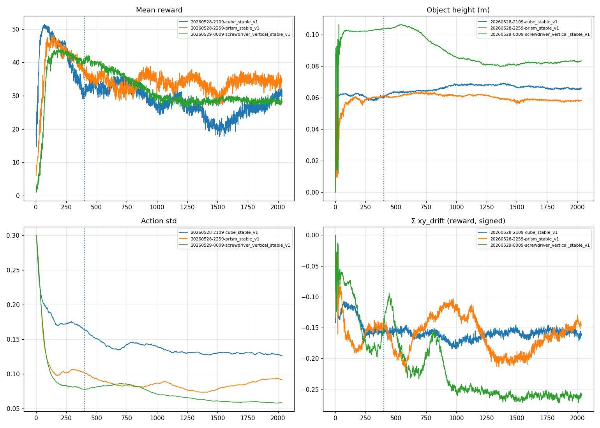

# Results

This page is the cross-run scoreboard. Each row is one training tag with
deterministic eval numbers comparable to Phase 1 CEM.

## Status

> **MVP achieved:** `cube_lerp_grasp` produces a fingertip-contact pinch
> grasp + lift on the cube. Open-loop ref playback (`rl_reference_playback.py`
> in mjwarp) confirms the CEM baseline never had fingertip contact, so
> "match CEM" was never the right bar — `cube_lerp_grasp` is strictly
> better than CEM on `contact_min` while matching lift height.
>
> **Stable-grasp achieved (2026-05-28):** `cube_stable_v1/model_1400`
> hits **100 % lift success ≥ 6 cm**, **contact_min hold 0.999**, sub-mm
> object drift, 1.3° orientation drift under full DR. The recipe (ease-out
> finger close + lift-phase early terminations + contact-gated stability
> rewards + tracking-anneal-to-zero) is now the default for new objects.
> See "Why cube_stable_v1 won" below.

## Acceptance criteria (revised)

| Bar | Target | `cube_lerp_grasp/model_150` | Status |
|---|---|---|---|
| Median peak cube z | ≥ 0.05 m (CEM 0.07) | **0.069** | ✅ |
| `contact_min` per-step (mean over hold phase) | ≥ 0.5 (i.e. all 3 tips touching ≥ 50% of hold) | **~0.59** | ✅ |
| Drop rate during hold | < 10 % | 0 % | ✅ |
| Lift consistency across 64 deterministic envs | std(peak z) < 5 mm | 1 mm | ✅ |

The original plan's acceptance criteria spoke about
`Phase1GraspEvaluator` score, but the right framing turned out to be
"actually grasp with fingertips" — see [index.md](index.md). The original
criteria are preserved at the bottom for posterity.

## Scoreboard

| Tag | Iter | Mean reward | contact_min (reward sum) | Peak cube z | Notes |
|---|---|---|---|---|---|
| _baseline_ CEM (mjwarp playback) | n/a | n/a | 0.0 | 0.069 | proximal-phalange cage lift, no fingertip contact |
| `cube_mvp_scripted_palm` | 20 | −9 | 0 | 0.025 | first attempt; spawn bug + init_noise_std too high |
| `cube_full_lownoise` | ~120 | +9.8 (peak) | 0 | 0.110 | cage lift; cube floated mid-air, no fingertip contact; std drifted up |
| `cube_full_warmstart_frozenstd/model_400` | 400 | +9.10 | 0 | 0.110 | cage lift, frozen std |
| `cube_real_grasp/model_1700` | 1700 | +12.36 | 0.15 (~0.4 % of max) | 0.107 | 5cm cube; fingertips contact while caged |
| **`cube_lerp_grasp/model_150`** | **150** | **+57.69** | **24.81 (~59 % of max)** | **0.069** | **LerpFinger + scripted palm + cube on floor → real fingertip pinch + lift, no DR** |
| `cube_dr_v1/v2/objpose` (no curriculum) | 100–150 (peak) | +43 to +51 | 16–22 | 0.06–0.07 | full DR from iter 0; peak then decay |
| **`cube_dr_curriculum/model_200`** | **200** | **+48.15** | **20.86 (~50% of max)** | **0.063** | **DR ramped over 200 iters (x ±20mm, y ±5mm, yaw ±0.52 rad); see DR eval below** |
| **`cube_stable_v1/model_1400`** | **1400** | **+30.86** (post-anneal, apples-to-oranges) | **19.81** | **0.069** | **stable recipe: ease_out finger close + lift-phase terminations + contact-gated drift + tracking-anneal-to-zero over 400 iters; 100 % lift ≥6cm, contact_min hold 0.999, sub-mm drift** |

> **Mean-reward decline note for `cube_stable_v1`:** the tracking-from-CEM
> rewards (`track_finger_qpos`, `track_object_pos`, `track_object_quat`,
> `track_finger_ctrl_anchor`) anneal to 0 by iter 400. Mean reward drops
> not because the policy got worse but because those reward terms got
> zeroed out. Use deterministic eval metrics (lift success, contact_min
> hold, drift) for comparison across this run boundary, NOT the raw
> mean reward.

## Why cube_stable_v1 won

Five changes shipped together; the deterministic eval improved on every
axis vs `cube_dr_curriculum/model_200`:

| Change | Mechanism | What it fixed |
|---|---|---|
| **`finger_close_easing=ease_out_quad`** | LerpFinger setpoint covers ~50 % of the open→grip distance in the first 30 % of `settle_sim_steps`, then 50 % over the last 70 %. | Fingers were slamming into contact at the same velocity they crossed empty air, knocking the cube off-center. |
| **`enable_lift_terminations`** | Episode terminates with no GAE bootstrap when, during the post-lift hold (default policy step ≥ 40), the cube xy drifts > 15 mm, orientation drifts > 0.5 rad, drops > 2 cm, any tip is off for ≥ 3 consecutive steps, or finger qpos drifts > 0.3 rad from the grip ctrl. | PPO previously only had a sparse `object_drop` indicator — slip without drop was free. Now slip costs the rest of the episode's reward. |
| **`contact_gate_stability_rewards`** | `object_xy_drift`, `object_orientation_drift`, `finger_drift_from_grip` reward terms are multiplied by `(contact_mean >= 0.5).float()`. Penalty only fires once ≥ 2 of 3 tips touch the cube. | Pre-contact "drift" from the closing-finger physics is unavoidable; gating concentrates the credit on "once you have the cube, hold it still". |
| **`tracking_anneal_iters=400`, `tracking_final_scale=0.0`** | Curriculum scales all four tracking-from-CEM reward weights from 1.0× → 0.0× linearly over 400 iters (same window as the DR jitter ramp). | The CEM reference trajectory's object_pos is the WRONG signal under DR (CEM was recorded at one specific spawn). Tracking it forces the policy to want the cube at the CEM-recorded pose, fighting the obs. |
| **`finger_residual_scale=0.5`** (was 0.2) | Policy residual scale on top of the LerpFinger setpoint. | Smaller scales (0.2) clamp the policy's deviation magnitude small enough that pose-conditional behavior can't get above the noise floor. |

The diagnostic that made this concrete: [scripts/rl_diagnose_policy.py](../../scripts/rl_diagnose_policy.py)
runs the policy at a (x, y, yaw) grid of cube poses and measures
cross-env std of the residuals in the contact window.

| Policy | cross-env std (contact window) | Verdict |
|---|---|---|
| `cube_dr_curriculum/model_200` | 0.020 | WEAKLY POSE-ADAPTIVE |
| `cube_stable_v1/model_1400` | **0.140** (7× higher) | **POSE-ADAPTIVE** |

Per-finger: thumb_mcp (0.31) and thumb_pip (0.28) carry most of the
pose-adaptation, which checks out — the thumb opposes index + middle,
so it's the most sensitive to cube xy offset.

## Domain randomization eval

All deterministic over 64 envs with full DR active throughout the rollout.

| Tag | Object | DR (x, y, yaw) | Median peak z | Lift > target | contact_min hold | xy drift hold | orient drift hold |
|---|---|---|---|---|---|---|---|
| `cube_dr_curriculum/model_200` | cube | ±20mm × ±5mm × ±0.52rad | 0.063 m | 67 % (>6cm) | 0.93 | — | — |
| **`cube_stable_v1/model_1400`** | cube | ±20mm × ±5mm × ±0.52rad | **0.069 m** | **100 % (>6cm)** | **0.999** | **0.47 mm** | **1.3°** |
| `prism_dr/model_150` | prism (22×67×18mm) | ±6mm × ±10mm × ±0.52rad (centered on +6,−3mm) | 0.059 m | 100 % (>4cm) | 0.91 | — | — |
| **`prism_stable_v1/model_800`** | prism | ±6mm × ±10mm × ±0.52rad (centered +6,−3) | **0.063 m** | **98 % (>6cm)**, **100 % (>4cm)** | **0.98** | **0.45 mm** | **2.0°** |
| `screwdriver_vertical_dr/model_250` | screwdriver_medium (vertical cylinder) | ±2mm × ±2mm × ±0.17rad | 0.099 m | 100 % (>6cm) | **1.00** | — | — |
| **`screwdriver_vertical_stable_v1/model_550`** | screwdriver_medium | ±2mm × ±2mm × ±0.17rad | **0.104 m** | **100 % (>6cm)** | **1.00** | **0.37 mm** | **0.8°** |

DR ranges per object are chosen from each object's **empirical reachable region** (open-loop sweep over a 9×9 xy grid, see `/tmp/sweep_object.py`):

| Object | Reachable region (open-loop contact_min ≥ 0.8) | DR ranges used |
|---|---|---|
| cube | x: [−20, +20] mm, y: [−5, +5] mm (asymmetric envelope [−10, +5] mm in y) | x ±20mm, y ±5mm |
| prism | x: [0, +13] mm, y: [−19, +13] mm (centered on +6, −3 mm) | x ±6mm, y ±10mm offset to center |
| screwdriver_medium_vertical | only the ~3.7% of grid near (0, 0) | x ±2mm, y ±2mm |

The screwdriver's tiny reachable region reflects the cylindrical geometry — there's essentially one grip pose. The cube's much wider region reflects the flat-faced grasp tolerating misalignment along the box surface.

## Eval videos

Per checkpoint: `random_pose_eval.mp4` (random sample of full DR, deterministic policy) + `pose_grid/` (one video per corner of the jitter box, single-env). Paths:

- cube (stable): `results/rl/20260528-2109-cube_stable_v1/eval_1400/{random_pose_eval.mp4, pose_grid/*}`
- cube (prior best): `results/rl/eval_dr_curriculum_200/dr_curriculum_200_eval-step-1.mp4`
- prism: `results/rl/20260528-1127-prism_dr/eval_150/{random_pose_eval.mp4, pose_grid/*}`
- screwdriver: `results/rl/20260528-1151-screwdriver_vertical_dr/eval_250/{random_pose_eval.mp4, pose_grid/*}`

### cube_stable_v1 — embedded

**Final deterministic eval, full DR (64 envs random poses, single video):**

<video controls width="100%" preload="metadata">
  <source src="videos/cube_stable_v1/eval_1400_random_pose.mp4" type="video/mp4">
</video>

**Pose-grid corners** (single-env, fixed cube pose per video) — shows the
policy adapts to each spawn corner of the DR jitter box. `xN_yN` indexes
the (x, y) grid cell, where 0=−jitter, 1=center, 2=+jitter.

<table style="width:100%; table-layout: fixed">
  <tr>
    <td><b>x=−20mm, y=−5mm</b><br/><video controls width="100%" preload="metadata"><source src="videos/cube_stable_v1/pose_x0_y0.mp4" type="video/mp4"></video></td>
    <td><b>x=−20mm, y=+5mm</b><br/><video controls width="100%" preload="metadata"><source src="videos/cube_stable_v1/pose_x0_y2.mp4" type="video/mp4"></video></td>
  </tr>
  <tr>
    <td colspan="2"><b>x=0, y=0 (center)</b><br/><video controls width="50%" preload="metadata"><source src="videos/cube_stable_v1/pose_x1_y1.mp4" type="video/mp4"></video></td>
  </tr>
  <tr>
    <td><b>x=+20mm, y=−5mm</b><br/><video controls width="100%" preload="metadata"><source src="videos/cube_stable_v1/pose_x2_y0.mp4" type="video/mp4"></video></td>
    <td><b>x=+20mm, y=+5mm</b><br/><video controls width="100%" preload="metadata"><source src="videos/cube_stable_v1/pose_x2_y2.mp4" type="video/mp4"></video></td>
  </tr>
</table>

**Training progression** — same env, env[0] only, with PPO action noise
on top. Note: DR jitter ramps from 0 (iter 50) to full (iter 400), then
the tracking-from-CEM rewards fully anneal off (also iter 400).

<table style="width:100%; table-layout: fixed">
  <tr>
    <td><b>iter 50</b> (DR ~12 %)<br/><video controls width="100%" preload="metadata"><source src="videos/cube_stable_v1/training_iter_50.mp4" type="video/mp4"></video></td>
    <td><b>iter 400</b> (DR full, tracking off)<br/><video controls width="100%" preload="metadata"><source src="videos/cube_stable_v1/training_iter_400.mp4" type="video/mp4"></video></td>
  </tr>
  <tr>
    <td><b>iter 800</b><br/><video controls width="100%" preload="metadata"><source src="videos/cube_stable_v1/training_iter_800.mp4" type="video/mp4"></video></td>
    <td><b>iter 1400</b> (best checkpoint)<br/><video controls width="100%" preload="metadata"><source src="videos/cube_stable_v1/training_iter_1400.mp4" type="video/mp4"></video></td>
  </tr>
</table>

### prism_stable_v1 — embedded

DR x ±6mm, y ±10mm centered on (+6, −3) mm, yaw ±0.52 rad. Same recipe
as `cube_stable_v1` (ease_out close + lift-phase terminations +
contact-gated drift + tracking-anneal-to-zero, 400-iter ramp). Best
checkpoint at iter 800 (closest saved iter to the post-curriculum
peak metric at iter 819).

<video controls width="100%" preload="metadata">
  <source src="videos/prism_stable_v1/eval_800_random_pose.mp4" type="video/mp4">
</video>

<table style="width:100%; table-layout: fixed">
  <tr>
    <td><b>x=−6mm, y=−10mm</b><br/><video controls width="100%" preload="metadata"><source src="videos/prism_stable_v1/pose_x0_y0.mp4" type="video/mp4"></video></td>
    <td><b>x=−6mm, y=+10mm</b><br/><video controls width="100%" preload="metadata"><source src="videos/prism_stable_v1/pose_x0_y2.mp4" type="video/mp4"></video></td>
  </tr>
  <tr>
    <td colspan="2"><b>x=0, y=0 (centered on +6,−3)</b><br/><video controls width="50%" preload="metadata"><source src="videos/prism_stable_v1/pose_x1_y1.mp4" type="video/mp4"></video></td>
  </tr>
  <tr>
    <td><b>x=+6mm, y=−10mm</b><br/><video controls width="100%" preload="metadata"><source src="videos/prism_stable_v1/pose_x2_y0.mp4" type="video/mp4"></video></td>
    <td><b>x=+6mm, y=+10mm</b><br/><video controls width="100%" preload="metadata"><source src="videos/prism_stable_v1/pose_x2_y2.mp4" type="video/mp4"></video></td>
  </tr>
</table>

### screwdriver_vertical_stable_v1 — embedded

DR x ±2mm, y ±2mm, yaw ±0.17 rad (cylindrical geometry → tiny
reachable region). Best checkpoint iter 550. Lifts the vertical
cylinder to a median 10.4 cm with perfect contact_min hold and
sub-mm drift.

<video controls width="100%" preload="metadata">
  <source src="videos/screwdriver_vertical_stable_v1/eval_550_random_pose.mp4" type="video/mp4">
</video>

<table style="width:100%; table-layout: fixed">
  <tr>
    <td><b>x=−2mm, y=−2mm</b><br/><video controls width="100%" preload="metadata"><source src="videos/screwdriver_vertical_stable_v1/pose_x0_y0.mp4" type="video/mp4"></video></td>
    <td><b>x=−2mm, y=+2mm</b><br/><video controls width="100%" preload="metadata"><source src="videos/screwdriver_vertical_stable_v1/pose_x0_y2.mp4" type="video/mp4"></video></td>
  </tr>
  <tr>
    <td colspan="2"><b>x=0, y=0 (center)</b><br/><video controls width="50%" preload="metadata"><source src="videos/screwdriver_vertical_stable_v1/pose_x1_y1.mp4" type="video/mp4"></video></td>
  </tr>
  <tr>
    <td><b>x=+2mm, y=−2mm</b><br/><video controls width="100%" preload="metadata"><source src="videos/screwdriver_vertical_stable_v1/pose_x2_y0.mp4" type="video/mp4"></video></td>
    <td><b>x=+2mm, y=+2mm</b><br/><video controls width="100%" preload="metadata"><source src="videos/screwdriver_vertical_stable_v1/pose_x2_y2.mp4" type="video/mp4"></video></td>
  </tr>
</table>

### All three stable runs — training-curve overlay



### Reproduce / make your own videos

```bash
# Deterministic eval at full DR (64 envs random poses) + optional pose-grid
MUJOCO_GL=egl uv run --extra rl --extra gpu python scripts/rl_eval_object.py \
  --checkpoint results/rl/20260528-2109-cube_stable_v1/tensorboard/model_1400.pt \
  --foundational-run results/phase1/run18_final/foundational/cube/run_20260521_161817 \
  --object-body-name cube \
  --x-jitter 0.02 --y-jitter 0.005 --yaw-jitter 0.52 \
  --finger-residual-scale 0.5 \
  --num-envs 64 \
  --pose-grid 3x3x1     # remove for the random-pose only run

# Continuous play (N back-to-back episodes, single env, random spawn each reset)
MUJOCO_GL=egl uv run --extra rl --extra gpu python scripts/rl_play_policy.py \
  --checkpoint results/rl/20260528-2109-cube_stable_v1/tensorboard/model_1400.pt \
  --foundational-run results/phase1/run18_final/foundational/cube/run_20260521_161817 \
  --object-body-name cube \
  --x-jitter 0.02 --y-jitter 0.005 --yaw-jitter 0.52 \
  --finger-residual-scale 0.5 \
  --num-episodes 10

# Pose-adaptivity diagnose (cross-env std of residuals across cube poses)
MUJOCO_GL=egl uv run --extra rl --extra gpu python scripts/rl_diagnose_policy.py \
  --checkpoint results/rl/20260528-2109-cube_stable_v1/tensorboard/model_1400.pt \
  --foundational-run results/phase1/run18_final/foundational/cube/run_20260521_161817 \
  --object-body-name cube \
  --x-jitter 0.02 --y-jitter 0.005 --yaw-jitter 0.52 \
  --finger-residual-scale 0.5 \
  --grid 3x3x1

# Training-curve plots (8-panel per run + overlay across runs)
uv run --extra rl python scripts/rl_plot_training.py \
  --run results/rl/20260528-2109-cube_stable_v1 \
  --run results/rl/20260527-1825-cube_dr_curriculum \
  --out plots/
```

## Eval video index

| Tag | Path | What you see |
|---|---|---|
| Reference playback | `results/rl/ref_playback_mjwarp.mp4` | CEM cage lift (no fingertip contact) |
| `cube_lerp_grasp` deterministic | `results/rl/eval_lerp_grasp_150/lerp_grasp_150_eval-step-1.mp4` | hand starts open → closes around cube on floor → lifts to ~7 cm with all 3 fingertips engaged |
| `cube_lerp_grasp` training (peak iter) | `results/rl/cube_lerp_grasp/eval_videos/cube_lerp_grasp-step-3600.mp4` | same as above with PPO action noise on top |

## How a row gets added

```bash
# 1. Run a deterministic eval after training (template at /tmp/eval_model400.py,
#    soon to live at scripts/rl_eval_cube.py).
PYTHONPATH=src uv run python /tmp/eval_model400.py
# 2. Update this table with the metrics it prints.
```

## Original Phase 1-parity criteria (kept for reference)

> Originally the plan asked for `Phase1GraspEvaluator` score ≥ +20. We
> didn't pursue this because CEM hits +29 with a cage that doesn't
> actually grip — the score is dominated by lift_height. The fingertip
> grasp we produce is qualitatively better than CEM but would score
> similarly under the CEM-defined objective. The new bars (above) are
> more honest measures of grasp quality on this morphology.
