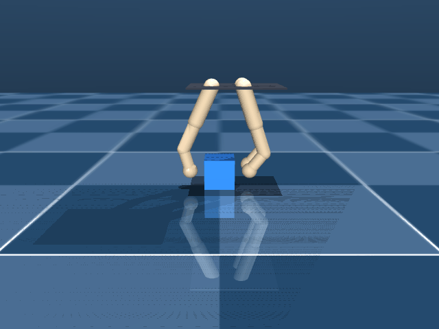
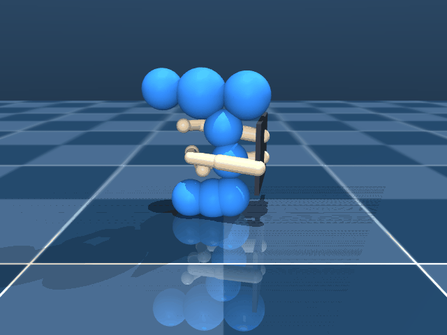
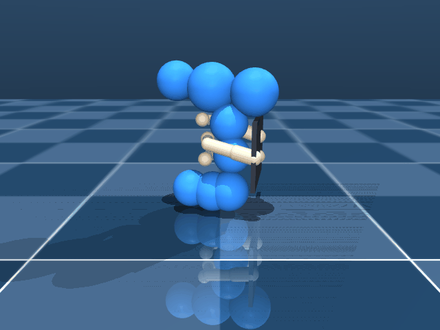
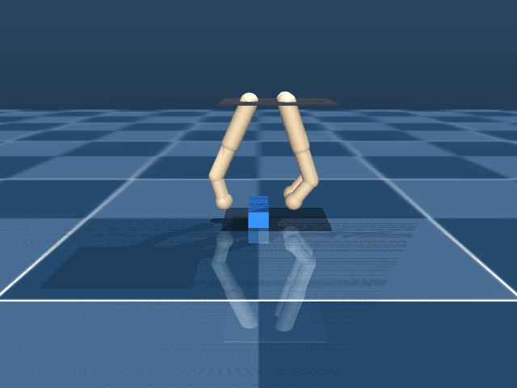
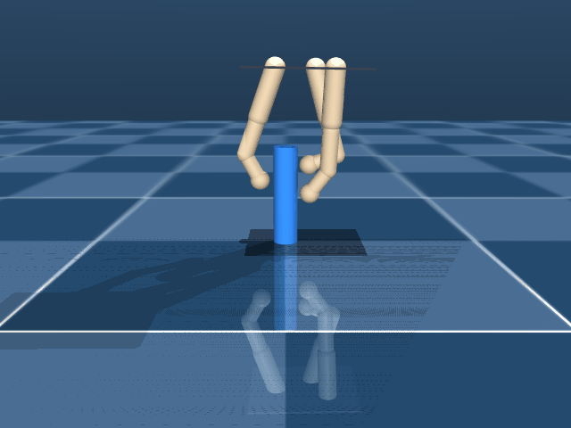
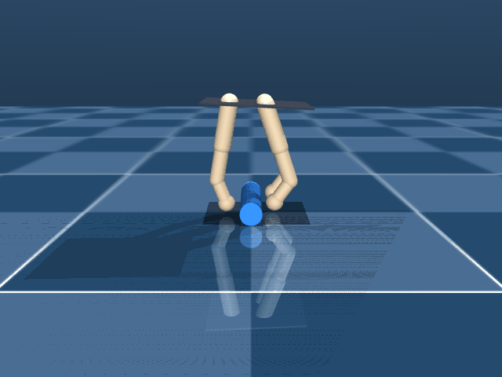
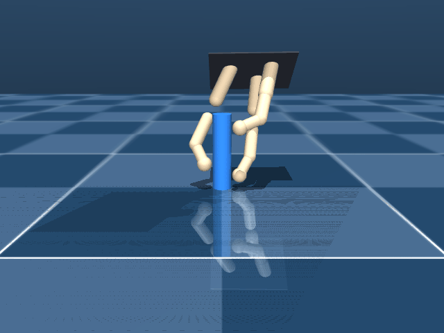
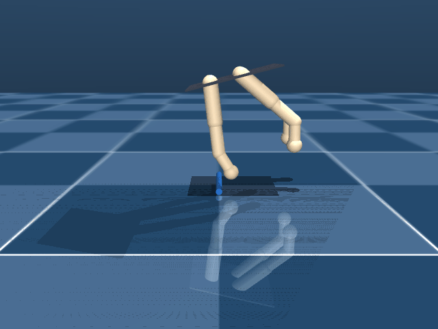

# Per-benchmark details

## `cube` — 40mm cube; pinch across X axis

- scene: `assets/mjcf/scene.xml`
- keyframe: `open`
- contact targets: `assets/contact_targets/cube.yaml`

| Method | oracle (baseline obj) | cube_lift | tip_contacts | all_finger_persist | fc_q1 |
|---|---:|---:|---:|---:|---:|
| `baseline` | 6.64 ± 0.13 | 0.0485 | 6.0 | 1.00 | nan |
| `contact_map` | 6.82 ± 0.31 | 0.0487 | 6.7 | 1.00 | nan |

 

## `power_drill` — Power drill at open_flat

- scene: `assets/mjcf/scene_power_drill.xml`
- keyframe: `open_flat`
- contact targets: `assets/contact_targets/power_drill_open_flat.yaml`

| Method | oracle (baseline obj) | cube_lift | tip_contacts | all_finger_persist | fc_q1 |
|---|---:|---:|---:|---:|---:|
| `baseline` | 7.39 ± 0.16 | 0.0536 | 7.7 | 1.00 | nan |
| `contact_map` | 7.06 ± 0.17 | 0.0518 | 7.3 | 1.00 | nan |

 

## `power_drill_short_proximal` — Power drill with short-proximal hand offset (active target)

- scene: `assets/mjcf/scene_power_drill_short_proximal.xml`
- keyframe: `open_flat`
- contact targets: `assets/contact_targets/power_drill_short_proximal.yaml`

| Method | oracle (baseline obj) | cube_lift | tip_contacts | all_finger_persist | fc_q1 |
|---|---:|---:|---:|---:|---:|
| `baseline` | 8.46 ± 0.29 | 0.0524 | 10.3 | 1.00 | nan |
| `contact_map` | 8.76 ± 0.36 | 0.0528 | 10.7 | 1.00 | nan |

 

## `prism` — 22x68x18mm prism long along Y; pinch grip across X

- scene: `assets/mjcf/scene_prism.xml`
- keyframe: `open`
- contact targets: `assets/contact_targets/prism.yaml`

| Method | oracle (baseline obj) | cube_lift | tip_contacts | all_finger_persist | fc_q1 |
|---|---:|---:|---:|---:|---:|
| `baseline` | 1.00 ± 0.17 | 0.0078 | 2.7 | 0.02 | nan |
| `contact_map` | 4.16 ± 1.96 | 0.0330 | 3.0 | 0.69 | nan |

 

## `screwdriver_medium_90vertical` — 12mm cyl screwdriver 90deg rotated

- scene: `assets/mjcf/scene_screwdriver_medium.xml`
- keyframe: `open_90vertical`
- contact targets: `assets/contact_targets/screwdriver_medium_open_90vertical.yaml`

| Method | oracle (baseline obj) | cube_lift | tip_contacts | all_finger_persist | fc_q1 |
|---|---:|---:|---:|---:|---:|
| `baseline` | 6.24 ± 0.41 | 0.0499 | 5.0 | 1.00 | nan |
| `contact_map` | 6.21 ± 0.11 | 0.0501 | 5.3 | 1.00 | nan |

 

## `screwdriver_medium_flat` — 12mm cyl screwdriver horizontal; wrap grip

- scene: `assets/mjcf/scene_screwdriver_medium.xml`
- keyframe: `open_flat`
- contact targets: `assets/contact_targets/screwdriver_medium_open_flat.yaml`

| Method | oracle (baseline obj) | cube_lift | tip_contacts | all_finger_persist | fc_q1 |
|---|---:|---:|---:|---:|---:|
| `baseline` | 5.67 ± 0.00 | 0.0490 | 3.0 | 1.00 | nan |
| `contact_map` | 5.39 ± 0.32 | 0.0480 | 3.0 | 1.00 | nan |

 

## `screwdriver_medium_vertical` — 12mm cyl screwdriver vertical

- scene: `assets/mjcf/scene_screwdriver_medium.xml`
- keyframe: `open_vertical`
- contact targets: `assets/contact_targets/screwdriver_medium_open_vertical.yaml`

| Method | oracle (baseline obj) | cube_lift | tip_contacts | all_finger_persist | fc_q1 |
|---|---:|---:|---:|---:|---:|
| `baseline` | 5.70 ± 0.00 | 0.0496 | 3.0 | 1.00 | nan |
| `contact_map` | 5.71 ± 0.00 | 0.0497 | 3.0 | 1.00 | nan |

 

## `screwdriver_small_flat` — 4mm thin screwdriver horizontal; hardest object

- scene: `assets/mjcf/scene_screwdriver_small.xml`
- keyframe: `open_flat`
- contact targets: `assets/contact_targets/screwdriver_small_open_flat.yaml`

| Method | oracle (baseline obj) | cube_lift | tip_contacts | all_finger_persist | fc_q1 |
|---|---:|---:|---:|---:|---:|
| `baseline` | -0.06 ± 0.01 | 0.0000 | 0.0 | 0.00 | nan |
| `contact_map` | -0.08 ± 0.01 | 0.0000 | 0.0 | 0.00 | nan |

 

