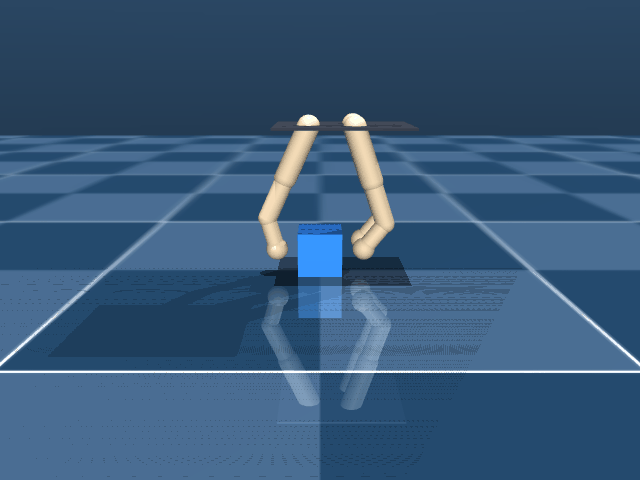
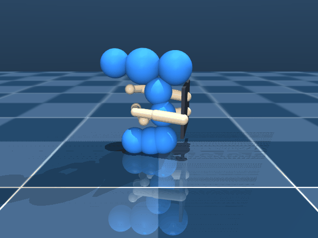
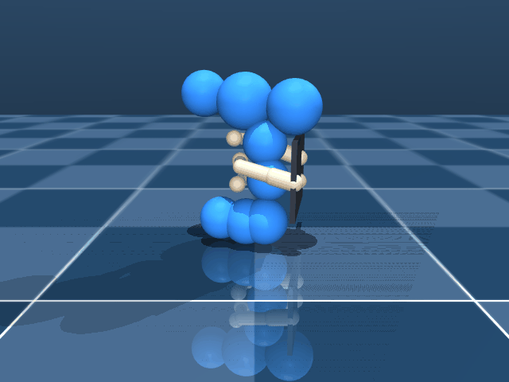
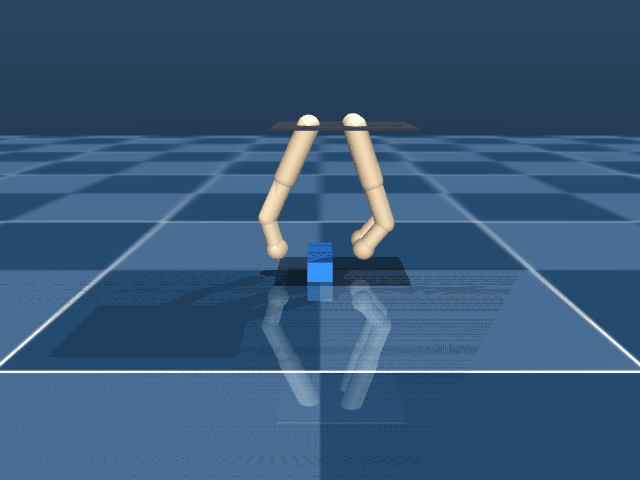
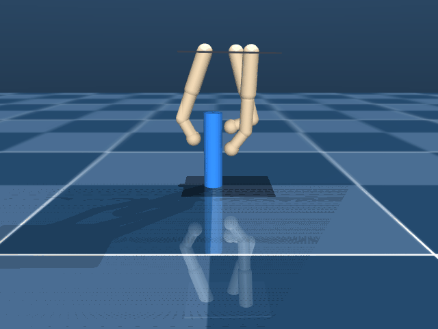
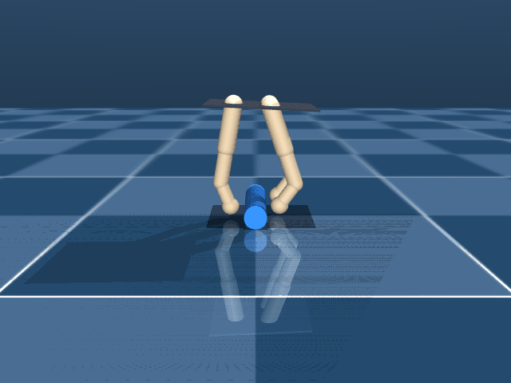
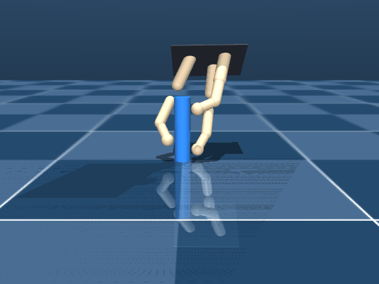
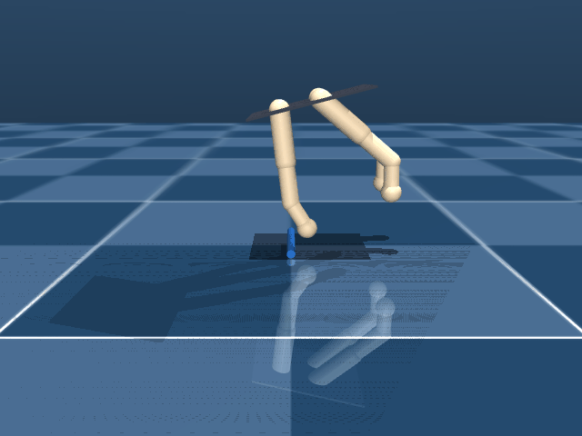

# Per-benchmark details

## `cube` — 40mm cube; pinch across X axis

- scene: `assets/mjcf/scene.xml`
- keyframe: `open`
- contact targets: `assets/contact_targets/cube.yaml`

| Method | oracle (baseline obj) | cube_lift | tip_contacts | all_finger_persist | fc_q1 |
|---|---:|---:|---:|---:|---:|
| `baseline` | 6.70 ± 0.17 | 0.0495 | 5.7 | 1.00 | nan |
| `contact_map` | 6.98 ± 0.19 | 0.0500 | 6.3 | 1.00 | nan |

 

## `power_drill` — Power drill at open_flat

- scene: `assets/mjcf/scene_power_drill.xml`
- keyframe: `open_flat`
- contact targets: `assets/contact_targets/power_drill_open_flat.yaml`

| Method | oracle (baseline obj) | cube_lift | tip_contacts | all_finger_persist | fc_q1 |
|---|---:|---:|---:|---:|---:|
| `baseline` | 7.37 ± 0.62 | 0.0528 | 7.7 | 1.00 | nan |
| `contact_map` | 6.20 ± 0.48 | 0.0423 | 6.3 | 1.00 | nan |

 

## `power_drill_short_proximal` — Power drill with short-proximal hand offset (active target)

- scene: `assets/mjcf/scene_power_drill_short_proximal.xml`
- keyframe: `open_flat`
- contact targets: `assets/contact_targets/power_drill_short_proximal.yaml`

| Method | oracle (baseline obj) | cube_lift | tip_contacts | all_finger_persist | fc_q1 |
|---|---:|---:|---:|---:|---:|
| `baseline` | 7.89 ± 0.47 | 0.0520 | 8.7 | 1.00 | nan |
| `contact_map` | 7.84 ± 0.42 | 0.0522 | 8.3 | 1.00 | nan |

 

## `prism` — 22x68x18mm prism long along Y; pinch grip across X

- scene: `assets/mjcf/scene_prism.xml`
- keyframe: `open`
- contact targets: `assets/contact_targets/prism.yaml`

| Method | oracle (baseline obj) | cube_lift | tip_contacts | all_finger_persist | fc_q1 |
|---|---:|---:|---:|---:|---:|
| `baseline` | 2.31 ± 1.10 | 0.0314 | 2.7 | 0.26 | nan |
| `contact_map` | 5.57 ± 0.08 | 0.0487 | 3.0 | 1.00 | nan |

 

## `screwdriver_medium_90vertical` — 12mm cyl screwdriver 90deg rotated

- scene: `assets/mjcf/scene_screwdriver_medium.xml`
- keyframe: `open_90vertical`
- contact targets: `assets/contact_targets/screwdriver_medium_open_90vertical.yaml`

| Method | oracle (baseline obj) | cube_lift | tip_contacts | all_finger_persist | fc_q1 |
|---|---:|---:|---:|---:|---:|
| `baseline` | 6.20 ± 0.52 | 0.0500 | 4.7 | 1.00 | nan |
| `contact_map` | 6.27 ± 0.57 | 0.0497 | 4.7 | 1.00 | nan |

 

## `screwdriver_medium_flat` — 12mm cyl screwdriver horizontal; wrap grip

- scene: `assets/mjcf/scene_screwdriver_medium.xml`
- keyframe: `open_flat`
- contact targets: `assets/contact_targets/screwdriver_medium_open_flat.yaml`

| Method | oracle (baseline obj) | cube_lift | tip_contacts | all_finger_persist | fc_q1 |
|---|---:|---:|---:|---:|---:|
| `baseline` | 5.52 ± 0.22 | 0.0485 | 3.0 | 1.00 | nan |
| `contact_map` | 5.85 ± 0.31 | 0.0482 | 3.7 | 1.00 | nan |

 

## `screwdriver_medium_vertical` — 12mm cyl screwdriver vertical

- scene: `assets/mjcf/scene_screwdriver_medium.xml`
- keyframe: `open_vertical`
- contact targets: `assets/contact_targets/screwdriver_medium_open_vertical.yaml`

| Method | oracle (baseline obj) | cube_lift | tip_contacts | all_finger_persist | fc_q1 |
|---|---:|---:|---:|---:|---:|
| `baseline` | 5.83 ± 0.17 | 0.0500 | 3.7 | 1.00 | nan |
| `contact_map` | 5.72 ± 0.01 | 0.0499 | 3.0 | 1.00 | nan |

 

## `screwdriver_small_flat` — 4mm thin screwdriver horizontal; hardest object

- scene: `assets/mjcf/scene_screwdriver_small.xml`
- keyframe: `open_flat`
- contact targets: `assets/contact_targets/screwdriver_small_open_flat.yaml`

| Method | oracle (baseline obj) | cube_lift | tip_contacts | all_finger_persist | fc_q1 |
|---|---:|---:|---:|---:|---:|
| `baseline` | -0.06 ± 0.00 | 0.0000 | 0.0 | 0.00 | nan |
| `contact_map` | -0.07 ± 0.01 | 0.0000 | 0.0 | 0.00 | nan |

 

